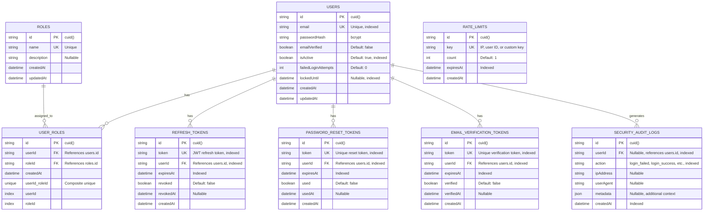

# Auth Service Database Design

## Overview

**Database Name**: `auth_db`  
**Service**: Auth Service  
**Purpose**: Authentication, authorization, and security management  
**Technology**: PostgreSQL 16+  
**ORM**: Prisma

---

## ER Diagram



---

## Table Specifications

### 1. `users` Table

**Purpose**: Core user authentication data

**Columns**:

| Column | Type | Constraints | Description |
|--------|------|-------------|-------------|
| `id` | VARCHAR(25) | PRIMARY KEY, DEFAULT cuid() | Unique user identifier |
| `email` | VARCHAR(255) | UNIQUE, NOT NULL, INDEXED | User email address |
| `password_hash` | VARCHAR(255) | NOT NULL | bcrypt hashed password |
| `email_verified` | BOOLEAN | DEFAULT false | Email verification status |
| `is_active` | BOOLEAN | DEFAULT true, INDEXED | Account active status |
| `failed_login_attempts` | INTEGER | DEFAULT 0 | Failed login counter |
| `locked_until` | TIMESTAMP | NULLABLE, INDEXED | Account lockout expiration |
| `created_at` | TIMESTAMP | DEFAULT now() | Account creation timestamp |
| `updated_at` | TIMESTAMP | DEFAULT now(), ON UPDATE now() | Last update timestamp |

**Indexes**:
- Primary Key: `id`
- Unique Index: `email`
- Index: `is_active` (for filtering active users)
- Index: `locked_until` (for lockout queries)

**Production Considerations**:
- **Partitioning**: Not needed (moderate growth)
- **Archiving**: Archive inactive users after 2 years
- **Encryption**: `password_hash` contains encrypted data (bcrypt)

---

### 2. `roles` Table

**Purpose**: RBAC role definitions

**Columns**:

| Column | Type | Constraints | Description |
|--------|------|-------------|-------------|
| `id` | VARCHAR(25) | PRIMARY KEY, DEFAULT cuid() | Unique role identifier |
| `name` | VARCHAR(100) | UNIQUE, NOT NULL | Role name (user, admin, etc.) |
| `description` | TEXT | NULLABLE | Role description |
| `created_at` | TIMESTAMP | DEFAULT now() | Creation timestamp |
| `updated_at` | TIMESTAMP | DEFAULT now(), ON UPDATE now() | Last update timestamp |

**Indexes**:
- Primary Key: `id`
- Unique Index: `name`

**Default Roles**:
- `user` - Standard user role
- `admin` - Administrator role
- `moderator` - Content moderator (future)

---

### 3. `user_roles` Table

**Purpose**: Many-to-many relationship between users and roles

**Columns**:

| Column | Type | Constraints | Description |
|--------|------|-------------|-------------|
| `id` | VARCHAR(25) | PRIMARY KEY, DEFAULT cuid() | Unique assignment identifier |
| `user_id` | VARCHAR(25) | FOREIGN KEY → users.id, INDEXED | User identifier |
| `role_id` | VARCHAR(25) | FOREIGN KEY → roles.id, INDEXED | Role identifier |
| `created_at` | TIMESTAMP | DEFAULT now() | Assignment timestamp |

**Indexes**:
- Primary Key: `id`
- Unique Constraint: `(user_id, role_id)` (prevents duplicate assignments)
- Index: `user_id` (for user role queries)
- Index: `role_id` (for role user queries)

**Foreign Keys**:
- `user_id` → `users.id` (CASCADE DELETE)
- `role_id` → `roles.id` (CASCADE DELETE)

---

### 4. `refresh_tokens` Table

**Purpose**: JWT refresh tokens for token rotation

**Columns**:

| Column | Type | Constraints | Description |
|--------|------|-------------|-------------|
| `id` | VARCHAR(25) | PRIMARY KEY, DEFAULT cuid() | Unique token identifier |
| `token` | VARCHAR(500) | UNIQUE, NOT NULL, INDEXED | JWT refresh token |
| `user_id` | VARCHAR(25) | FOREIGN KEY → users.id, INDEXED | User identifier |
| `expires_at` | TIMESTAMP | NOT NULL, INDEXED | Token expiration |
| `revoked` | BOOLEAN | DEFAULT false | Revocation status |
| `revoked_at` | TIMESTAMP | NULLABLE | Revocation timestamp |
| `created_at` | TIMESTAMP | DEFAULT now() | Creation timestamp |

**Indexes**:
- Primary Key: `id`
- Unique Index: `token` (for token lookup)
- Index: `user_id` (for user token queries)
- Index: `expires_at` (for cleanup queries)

**Foreign Keys**:
- `user_id` → `users.id` (CASCADE DELETE)

**Production Considerations**:
- **Cleanup Job**: Delete expired tokens daily
- **Token Rotation**: Implement refresh token rotation for security

---

### 5. `password_reset_tokens` Table

**Purpose**: Password reset token management

**Columns**:

| Column | Type | Constraints | Description |
|--------|------|-------------|-------------|
| `id` | VARCHAR(25) | PRIMARY KEY, DEFAULT cuid() | Unique token identifier |
| `token` | VARCHAR(255) | UNIQUE, NOT NULL, INDEXED | Reset token |
| `user_id` | VARCHAR(25) | FOREIGN KEY → users.id, INDEXED | User identifier |
| `expires_at` | TIMESTAMP | NOT NULL, INDEXED | Token expiration |
| `used` | BOOLEAN | DEFAULT false | Usage status |
| `used_at` | TIMESTAMP | NULLABLE | Usage timestamp |
| `created_at` | TIMESTAMP | DEFAULT now() | Creation timestamp |

**Indexes**:
- Primary Key: `id`
- Unique Index: `token` (for token lookup)
- Index: `user_id` (for user token queries)
- Index: `expires_at` (for cleanup queries)

**Foreign Keys**:
- `user_id` → `users.id` (CASCADE DELETE)

**Production Considerations**:
- **Cleanup Job**: Delete expired/used tokens after 24 hours
- **Token Expiry**: Default 1 hour expiration

---

### 6. `email_verification_tokens` Table

**Purpose**: Email verification token management

**Columns**:

| Column | Type | Constraints | Description |
|--------|------|-------------|-------------|
| `id` | VARCHAR(25) | PRIMARY KEY, DEFAULT cuid() | Unique token identifier |
| `token` | VARCHAR(255) | UNIQUE, NOT NULL, INDEXED | Verification token |
| `user_id` | VARCHAR(25) | FOREIGN KEY → users.id, INDEXED | User identifier |
| `expires_at` | TIMESTAMP | NOT NULL, INDEXED | Token expiration |
| `verified` | BOOLEAN | DEFAULT false | Verification status |
| `verified_at` | TIMESTAMP | NULLABLE | Verification timestamp |
| `created_at` | TIMESTAMP | DEFAULT now() | Creation timestamp |

**Indexes**:
- Primary Key: `id`
- Unique Index: `token` (for token lookup)
- Index: `user_id` (for user token queries)
- Index: `expires_at` (for cleanup queries)

**Foreign Keys**:
- `user_id` → `users.id` (CASCADE DELETE)

**Production Considerations**:
- **Cleanup Job**: Delete expired/verified tokens after 7 days
- **Token Expiry**: Default 24 hours expiration

---

### 7. `security_audit_logs` Table

**Purpose**: Security event logging and audit trail

**Columns**:

| Column | Type | Constraints | Description |
|--------|------|-------------|-------------|
| `id` | VARCHAR(25) | PRIMARY KEY, DEFAULT cuid() | Unique log identifier |
| `user_id` | VARCHAR(25) | FOREIGN KEY → users.id, NULLABLE, INDEXED | User identifier (nullable for system events) |
| `action` | VARCHAR(100) | NOT NULL, INDEXED | Action type (login_failed, login_success, etc.) |
| `ip_address` | VARCHAR(45) | NULLABLE | IP address (IPv4 or IPv6) |
| `user_agent` | TEXT | NULLABLE | User agent string |
| `metadata` | JSONB | NULLABLE | Additional context (reason, etc.) |
| `created_at` | TIMESTAMP | DEFAULT now(), INDEXED | Event timestamp |

**Indexes**:
- Primary Key: `id`
- Index: `user_id` (for user audit queries)
- Index: `action` (for action filtering)
- Index: `created_at` (for time-based queries)
- Composite Index: `(user_id, created_at)` (for user history)

**Foreign Keys**:
- `user_id` → `users.id` (SET NULL on delete)

**Action Types**:
- `login_success` - Successful login
- `login_failed` - Failed login attempt
- `login_blocked` - Login blocked (account locked)
- `account_locked` - Account locked due to failed attempts
- `password_changed` - Password changed
- `password_reset_requested` - Password reset requested
- `password_reset_completed` - Password reset completed
- `email_verification_sent` - Email verification sent
- `email_verified` - Email verified
- `account_deactivated` - Account deactivated
- `account_reactivated` - Account reactivated

**Production Considerations**:
- **Partitioning**: Partition by month for large volumes
- **Retention**: Archive logs older than 1 year
- **Performance**: Use time-based indexes for queries

---

### 8. `devices` Table

**Purpose**: Device tracking and management for security

**Columns**:

| Column | Type | Constraints | Description |
|--------|------|-------------|-------------|
| `id` | VARCHAR(25) | PRIMARY KEY, DEFAULT cuid() | Unique device identifier |
| `user_id` | VARCHAR(25) | FOREIGN KEY → users.id, INDEXED | User identifier |
| `device_id` | VARCHAR(255) | UNIQUE, NOT NULL | Device fingerprint/ID |
| `device_name` | VARCHAR(255) | NULLABLE | User-friendly device name |
| `device_type` | VARCHAR(50) | NULLABLE | Device type (mobile, desktop, tablet) |
| `user_agent` | TEXT | NULLABLE | User agent string |
| `ip_address` | VARCHAR(45) | NULLABLE | IP address |
| `is_trusted` | BOOLEAN | DEFAULT false, INDEXED | Trust status |
| `is_active` | BOOLEAN | DEFAULT true, INDEXED | Active status |
| `last_used_at` | TIMESTAMP | NULLABLE, INDEXED | Last usage timestamp |
| `created_at` | TIMESTAMP | DEFAULT now() | Creation timestamp |
| `updated_at` | TIMESTAMP | DEFAULT now(), ON UPDATE now() | Last update timestamp |

**Indexes**:
- Primary Key: `id`
- Unique Index: `device_id` (for device lookup)
- Index: `user_id` (for user device queries)
- Index: `is_trusted` (for filtering trusted devices)
- Index: `is_active` (for filtering active devices)
- Index: `last_used_at` (for cleanup queries)

**Foreign Keys**:
- `user_id` → `users.id` (CASCADE DELETE)

**Business Rules**:
- One device record per device per user
- Devices can be marked as trusted
- Inactive devices can be cleaned up after period

---

### 9. `login_history` Table

**Purpose**: Detailed login history tracking with IP, location, device info

**Columns**:

| Column | Type | Constraints | Description |
|--------|------|-------------|-------------|
| `id` | VARCHAR(25) | PRIMARY KEY, DEFAULT cuid() | Unique history record identifier |
| `user_id` | VARCHAR(25) | FOREIGN KEY → users.id, INDEXED | User identifier |
| `status` | VARCHAR(20) | NOT NULL, INDEXED | Login status (success, failed, blocked) |
| `ip_address` | VARCHAR(45) | NULLABLE, INDEXED | IP address |
| `user_agent` | TEXT | NULLABLE | User agent string |
| `device_id` | VARCHAR(255) | NULLABLE, INDEXED | Device identifier |
| `country` | VARCHAR(2) | NULLABLE | Country code (ISO 3166-1 alpha-2) |
| `city` | VARCHAR(100) | NULLABLE | City name |
| `is_suspicious` | BOOLEAN | DEFAULT false, INDEXED | Suspicious login flag |
| `risk_score` | INTEGER | NULLABLE | Risk score (0-100) |
| `metadata` | JSONB | NULLABLE | Additional context |
| `created_at` | TIMESTAMP | DEFAULT now(), INDEXED | Login timestamp |

**Indexes**:
- Primary Key: `id`
- Index: `user_id` (for user history queries)
- Index: `status` (for filtering by status)
- Index: `ip_address` (for IP-based queries)
- Index: `device_id` (for device-based queries)
- Index: `is_suspicious` (for suspicious login queries)
- Index: `created_at` (for time-based queries)
- Composite Index: `(user_id, created_at)` (for user history)

**Foreign Keys**:
- `user_id` → `users.id` (CASCADE DELETE)
- `device_id` → `devices.id` (SET NULL on delete)

**Business Rules**:
- Record created for every login attempt
- Suspicious logins flagged with risk score
- Geolocation data populated when available

---

### 10. `user_sessions` Table

**Purpose**: Active session management

**Columns**:

| Column | Type | Constraints | Description |
|--------|------|-------------|-------------|
| `id` | VARCHAR(25) | PRIMARY KEY, DEFAULT cuid() | Unique session identifier |
| `user_id` | VARCHAR(25) | FOREIGN KEY → users.id, INDEXED | User identifier |
| `refresh_token_id` | VARCHAR(25) | FOREIGN KEY → refresh_tokens.id, NULLABLE | Refresh token reference |
| `device_id` | VARCHAR(255) | NULLABLE, INDEXED | Device identifier |
| `ip_address` | VARCHAR(45) | NULLABLE | IP address |
| `user_agent` | TEXT | NULLABLE | User agent string |
| `is_active` | BOOLEAN | DEFAULT true, INDEXED | Active status |
| `expires_at` | TIMESTAMP | NOT NULL, INDEXED | Session expiration |
| `last_activity_at` | TIMESTAMP | NULLABLE, INDEXED | Last activity timestamp |
| `created_at` | TIMESTAMP | DEFAULT now() | Creation timestamp |
| `updated_at` | TIMESTAMP | DEFAULT now(), ON UPDATE now() | Last update timestamp |

**Indexes**:
- Primary Key: `id`
- Index: `user_id` (for user session queries)
- Index: `refresh_token_id` (for token lookup)
- Index: `device_id` (for device-based queries)
- Index: `is_active` (for filtering active sessions)
- Index: `expires_at` (for cleanup queries)
- Index: `last_activity_at` (for activity tracking)

**Foreign Keys**:
- `user_id` → `users.id` (CASCADE DELETE)
- `refresh_token_id` → `refresh_tokens.id` (SET NULL on delete)

**Business Rules**:
- One session per refresh token
- Sessions expire based on refresh token expiration
- Inactive sessions can be cleaned up

---

### 11. `mfa_backup_codes` Table

**Purpose**: MFA backup codes for account recovery

**Columns**:

| Column | Type | Constraints | Description |
|--------|------|-------------|-------------|
| `id` | VARCHAR(25) | PRIMARY KEY, DEFAULT cuid() | Unique code identifier |
| `user_id` | VARCHAR(25) | FOREIGN KEY → users.id, INDEXED | User identifier |
| `code` | VARCHAR(255) | NOT NULL, INDEXED | Hashed backup code |
| `used` | BOOLEAN | DEFAULT false, INDEXED | Usage status |
| `used_at` | TIMESTAMP | NULLABLE | Usage timestamp |
| `created_at` | TIMESTAMP | DEFAULT now() | Creation timestamp |
| `expires_at` | TIMESTAMP | NOT NULL, INDEXED | Expiration timestamp |

**Indexes**:
- Primary Key: `id`
- Index: `user_id` (for user code queries)
- Index: `code` (for code lookup)
- Index: `used` (for filtering used codes)
- Index: `expires_at` (for cleanup queries)

**Foreign Keys**:
- `user_id` → `users.id` (CASCADE DELETE)

**Business Rules**:
- Codes are hashed before storage
- Codes expire after set period
- Used codes cannot be reused

**Note**: The `users` table also includes MFA fields:
- `mfa_enabled` (BOOLEAN) - MFA enabled flag
- `mfa_secret` (VARCHAR) - TOTP secret (encrypted)
- `mfa_backup_codes` (TEXT[]) - Backup codes array (encrypted)

---

### 12. `rate_limits` Table (Optional)

**Purpose**: Rate limiting tracking (alternative to Redis)

**Columns**:

| Column | Type | Constraints | Description |
|--------|------|-------------|-------------|
| `id` | VARCHAR(25) | PRIMARY KEY, DEFAULT cuid() | Unique limit identifier |
| `key` | VARCHAR(255) | UNIQUE, NOT NULL | Rate limit key (IP, user ID, etc.) |
| `count` | INTEGER | DEFAULT 1 | Request count |
| `expires_at` | TIMESTAMP | NOT NULL, INDEXED | Expiration timestamp |
| `created_at` | TIMESTAMP | DEFAULT now() | Creation timestamp |

**Indexes**:
- Primary Key: `id`
- Unique Index: `key` (for key lookup)
- Index: `expires_at` (for cleanup queries)

**Production Considerations**:
- **Redis Preferred**: Use Redis for rate limiting in production
- **Cleanup Job**: Delete expired entries hourly
- **Fallback**: Use this table if Redis is unavailable

---

## Indexing Strategy

### Primary Indexes
- All primary keys (automatic)

### Performance Indexes
- `users.email` - Unique index for login lookups
- `users.is_active` - Filter active users
- `users.locked_until` - Check account lockout
- `users.mfa_enabled` - Filter MFA-enabled users
- `refresh_tokens.token` - Token validation
- `refresh_tokens.expires_at` - Cleanup expired tokens
- `devices.user_id` - User device queries
- `devices.device_id` - Device lookup
- `login_history.user_id` - User history queries
- `login_history.status` - Filter by status
- `login_history.is_suspicious` - Suspicious login queries
- `user_sessions.user_id` - User session queries
- `user_sessions.is_active` - Active session queries
- `security_audit_logs.created_at` - Time-based queries
- `security_audit_logs.user_id, created_at` - User audit history

### Composite Indexes
- `user_roles(user_id, role_id)` - Unique constraint
- `security_audit_logs(user_id, created_at)` - User history queries
- `login_history(user_id, created_at)` - User login history

---

## Production Optimizations

### 1. Connection Pooling

```typescript
// Prisma configuration
datasource db {
  provider = "postgresql"
  url      = env("DATABASE_URL")
  // Recommended pool settings:
  // max_connections=100
  // connection_timeout=10
  // pool_timeout=20
}
```

### 2. Query Optimization

**Slow Query Monitoring**:
- Monitor queries > 100ms
- Use `EXPLAIN ANALYZE` for optimization
- Enable `pg_stat_statements` extension

**Common Optimizations**:
- Use prepared statements
- Batch operations where possible
- Avoid N+1 queries

### 3. Backup Strategy

**Automated Backups**:
- Daily full backups at 2 AM UTC
- Hourly incremental backups
- Point-in-time recovery (PITR) enabled
- Cross-region backup replication

**Retention**:
- Daily backups: 30 days
- Weekly backups: 12 weeks
- Monthly backups: 12 months

### 4. Monitoring

**Key Metrics**:
- Connection pool usage
- Query performance (p95, p99)
- Table sizes and growth
- Index usage statistics
- Lock contention

**Alerts**:
- Connection pool > 80% capacity
- Query time > 1 second
- Database size growth > 10% per day
- Failed login attempts spike

---

## Security Considerations

### 1. Data Encryption

- **At Rest**: Database encryption enabled (AWS RDS)
- **In Transit**: SSL/TLS for all connections
- **Password Hashing**: bcrypt with salt (cost factor 12)

### 2. Access Control

- **Database Users**: Separate users for application and admin
- **IP Whitelisting**: VPC-only access
- **Credential Management**: AWS Secrets Manager

### 3. Audit Logging

- All sensitive operations logged to `security_audit_logs`
- Log retention: 1 year (active), 7 years (archived)
- Compliance: GDPR, SOC 2 ready

---

## Migration Strategy

### Development

```bash
# Create migration
npx prisma migrate dev --name add_feature_name

# Apply migration
npx prisma migrate deploy
```

### Production

1. **Create Migration**: Developer creates migration locally
2. **Review**: Code review and schema review
3. **Test**: Test in staging environment
4. **Deploy**: Apply during maintenance window
5. **Verify**: Verify migration success
6. **Rollback Plan**: Always have rollback ready

### Best Practices

- ✅ Always test migrations on staging first
- ✅ Use transactions for multi-step migrations
- ✅ Add indexes concurrently to avoid locks
- ✅ Never drop columns without deprecation period
- ✅ Monitor migration execution time

---

## Estimated Capacity

### Current Scale (Production)

- **Users**: 1,000,000
- **Refresh Tokens**: 2,000,000 (active)
- **Security Audit Logs**: 50,000,000 (1 year retention)
- **Password Reset Tokens**: 10,000 (active)

### Growth Projections

- **New Users**: 10,000/month
- **Login Events**: 1,000,000/month
- **Security Logs**: 5,000,000/month

### Storage Estimates

- **Database Size**: ~50 GB
- **Monthly Growth**: ~5 GB
- **Index Size**: ~10 GB

---

## Next Steps

- View [User Service Database](./02-user-service-database.md)
- View [Cross-Service References](./08-cross-service-references.md)
- Return to [Database Architecture Overview](./README.md)

