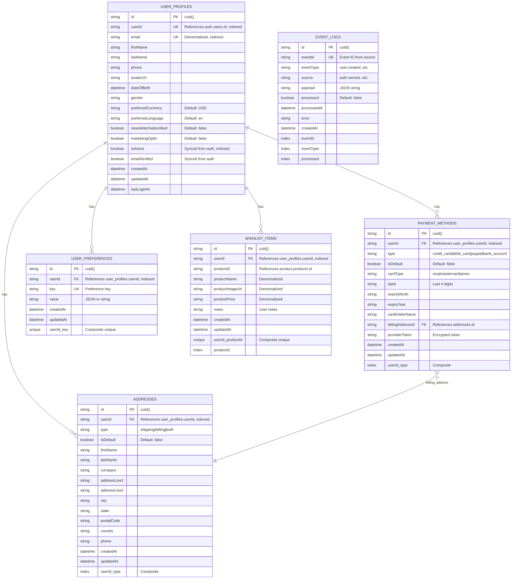

# User Service Database Design

## Overview

**Database Name**: `user_db`  
**Service**: User Service  
**Purpose**: User profile management, addresses, payment methods, preferences, and wishlist  
**Technology**: PostgreSQL 16+  
**ORM**: Prisma

---

## ER Diagram



---

## Table Specifications

### 1. `user_profiles` Table

**Purpose**: Extended user profile information (complements auth-service user data)

**Columns**:

| Column | Type | Constraints | Description |
|--------|------|-------------|-------------|
| `id` | VARCHAR(25) | PRIMARY KEY, DEFAULT cuid() | Unique profile identifier |
| `user_id` | VARCHAR(25) | UNIQUE, NOT NULL, INDEXED | References auth-service `users.id` (no FK constraint) |
| `email` | VARCHAR(255) | UNIQUE, NOT NULL, INDEXED | Denormalized email for quick lookups |
| `first_name` | VARCHAR(100) | NULLABLE | User's first name |
| `last_name` | VARCHAR(100) | NULLABLE | User's last name |
| `phone` | VARCHAR(20) | NULLABLE | Phone number (E.164 format) |
| `avatar_url` | VARCHAR(500) | NULLABLE | Profile picture URL |
| `date_of_birth` | DATE | NULLABLE | Date of birth |
| `gender` | VARCHAR(20) | NULLABLE | Gender (male, female, other, prefer-not-to-say) |
| `preferred_currency` | VARCHAR(3) | DEFAULT 'USD' | Preferred currency code |
| `preferred_language` | VARCHAR(2) | DEFAULT 'en' | Preferred language code (ISO 639-1) |
| `newsletter_subscribed` | BOOLEAN | DEFAULT false | Newsletter subscription status |
| `marketing_opt_in` | BOOLEAN | DEFAULT false | Marketing communications opt-in |
| `is_active` | BOOLEAN | DEFAULT true, INDEXED | Account status (synced from auth-service) |
| `email_verified` | BOOLEAN | DEFAULT false | Email verification status (synced from auth-service) |
| `created_at` | TIMESTAMP | DEFAULT now() | Profile creation timestamp |
| `updated_at` | TIMESTAMP | DEFAULT now(), ON UPDATE now() | Last update timestamp |
| `last_login_at` | TIMESTAMP | NULLABLE | Last login timestamp |

**Indexes**:
- Primary Key: `id`
- Unique Index: `user_id` (one profile per user)
- Unique Index: `email` (for email lookups)
- Index: `is_active` (for filtering active users)

**Cross-Service Reference**:
- `user_id` references `auth.users.id` (logical reference, no FK constraint)
- Synchronized via `user.created` event from auth-service

**Production Considerations**:
- **Denormalization**: `email` is stored here for performance (also in auth-service)
- **Event Sync**: `is_active` and `email_verified` synced via events
- **Archiving**: Archive inactive profiles after 2 years

---

### 2. `addresses` Table

**Purpose**: User shipping and billing addresses

**Columns**:

| Column | Type | Constraints | Description |
|--------|------|-------------|-------------|
| `id` | VARCHAR(25) | PRIMARY KEY, DEFAULT cuid() | Unique address identifier |
| `user_id` | VARCHAR(25) | FOREIGN KEY → user_profiles.userId, INDEXED | User identifier |
| `type` | VARCHAR(20) | NOT NULL | Address type (shipping, billing, both) |
| `is_default` | BOOLEAN | DEFAULT false | Default address flag |
| `first_name` | VARCHAR(100) | NOT NULL | First name |
| `last_name` | VARCHAR(100) | NOT NULL | Last name |
| `company` | VARCHAR(255) | NULLABLE | Company name |
| `address_line1` | VARCHAR(255) | NOT NULL | Street address line 1 |
| `address_line2` | VARCHAR(255) | NULLABLE | Street address line 2 |
| `city` | VARCHAR(100) | NOT NULL | City |
| `state` | VARCHAR(100) | NULLABLE | State/Province |
| `postal_code` | VARCHAR(20) | NOT NULL | Postal/ZIP code |
| `country` | VARCHAR(2) | NOT NULL | Country code (ISO 3166-1 alpha-2) |
| `phone` | VARCHAR(20) | NULLABLE | Phone number |
| `created_at` | TIMESTAMP | DEFAULT now() | Creation timestamp |
| `updated_at` | TIMESTAMP | DEFAULT now(), ON UPDATE now() | Last update timestamp |

**Indexes**:
- Primary Key: `id`
- Index: `user_id` (for user address queries)
- Composite Index: `(user_id, type)` (for type-specific queries)

**Foreign Keys**:
- `user_id` → `user_profiles.userId` (CASCADE DELETE)

**Business Rules**:
- Only one default address per type per user
- Enforced at application level (not database constraint)

---

### 3. `payment_methods` Table

**Purpose**: User payment methods (credit cards, PayPal, etc.)

**Columns**:

| Column | Type | Constraints | Description |
|--------|------|-------------|-------------|
| `id` | VARCHAR(25) | PRIMARY KEY, DEFAULT cuid() | Unique payment method identifier |
| `user_id` | VARCHAR(25) | FOREIGN KEY → user_profiles.userId, INDEXED | User identifier |
| `type` | VARCHAR(20) | NOT NULL | Payment type (credit_card, debit_card, paypal, bank_account) |
| `is_default` | BOOLEAN | DEFAULT false | Default payment method flag |
| `card_type` | VARCHAR(20) | NULLABLE | Card type (visa, mastercard, amex, etc.) |
| `last4` | VARCHAR(4) | NULLABLE | Last 4 digits of card |
| `expiry_month` | VARCHAR(2) | NULLABLE | Expiry month (01-12) |
| `expiry_year` | VARCHAR(4) | NULLABLE | Expiry year (YYYY) |
| `cardholder_name` | VARCHAR(255) | NULLABLE | Cardholder name |
| `billing_address_id` | VARCHAR(25) | FOREIGN KEY → addresses.id, NULLABLE | Billing address reference |
| `provider_token` | VARCHAR(500) | NULLABLE | Encrypted payment provider token |
| `created_at` | TIMESTAMP | DEFAULT now() | Creation timestamp |
| `updated_at` | TIMESTAMP | DEFAULT now(), ON UPDATE now() | Last update timestamp |

**Indexes**:
- Primary Key: `id`
- Index: `user_id` (for user payment method queries)
- Composite Index: `(user_id, type)` (for type-specific queries)

**Foreign Keys**:
- `user_id` → `user_profiles.userId` (CASCADE DELETE)
- `billing_address_id` → `addresses.id` (SET NULL on delete)

**Security Considerations**:
- **PCI Compliance**: Only store last 4 digits and token (encrypted)
- **Token Storage**: `provider_token` encrypted at application level
- **No Full Card Data**: Never store full card numbers or CVV

**Production Considerations**:
- **Tokenization**: Use payment provider tokenization (Stripe, PayPal, etc.)
- **Encryption**: Encrypt `provider_token` field
- **Compliance**: PCI DSS compliant storage

---

### 4. `user_preferences` Table

**Purpose**: Key-value store for user preferences and settings

**Columns**:

| Column | Type | Constraints | Description |
|--------|------|-------------|-------------|
| `id` | VARCHAR(25) | PRIMARY KEY, DEFAULT cuid() | Unique preference identifier |
| `user_id` | VARCHAR(25) | FOREIGN KEY → user_profiles.userId, INDEXED | User identifier |
| `key` | VARCHAR(100) | NOT NULL | Preference key |
| `value` | TEXT | NOT NULL | Preference value (JSON or string) |
| `created_at` | TIMESTAMP | DEFAULT now() | Creation timestamp |
| `updated_at` | TIMESTAMP | DEFAULT now(), ON UPDATE now() | Last update timestamp |

**Indexes**:
- Primary Key: `id`
- Unique Constraint: `(user_id, key)` (one value per key per user)
- Index: `user_id` (for user preference queries)

**Foreign Keys**:
- `user_id` → `user_profiles.userId` (CASCADE DELETE)

**Common Preference Keys**:
- `theme` - UI theme preference (light, dark)
- `notifications.email` - Email notification settings (JSON)
- `notifications.push` - Push notification settings (JSON)
- `currency` - Preferred currency
- `language` - Preferred language
- `timezone` - User timezone

---

### 5. `wishlist_items` Table

**Purpose**: User wishlist items (products user wants to buy later)

**Columns**:

| Column | Type | Constraints | Description |
|--------|------|-------------|-------------|
| `id` | VARCHAR(25) | PRIMARY KEY, DEFAULT cuid() | Unique wishlist item identifier |
| `user_id` | VARCHAR(25) | FOREIGN KEY → user_profiles.userId, INDEXED | User identifier |
| `product_id` | VARCHAR(25) | NOT NULL, INDEXED | References product-service `products.id` (no FK constraint) |
| `product_name` | VARCHAR(255) | NULLABLE | Denormalized product name |
| `product_image_url` | VARCHAR(500) | NULLABLE | Denormalized product image URL |
| `product_price` | DECIMAL(10,2) | NULLABLE | Denormalized product price at time of adding |
| `notes` | TEXT | NULLABLE | User notes about this item |
| `created_at` | TIMESTAMP | DEFAULT now() | Creation timestamp |
| `updated_at` | TIMESTAMP | DEFAULT now(), ON UPDATE now() | Last update timestamp |

**Indexes**:
- Primary Key: `id`
- Unique Constraint: `(user_id, product_id)` (one entry per product per user)
- Index: `user_id` (for user wishlist queries)
- Index: `product_id` (for product popularity queries)

**Foreign Keys**:
- `user_id` → `user_profiles.userId` (CASCADE DELETE)

**Cross-Service Reference**:
- `product_id` references `product.products.id` (logical reference, no FK constraint)

**Denormalization**:
- `product_name`, `product_image_url`, `product_price` stored for performance
- Updated via events when product changes

---

### 6. `event_logs` Table

**Purpose**: Track consumed events for idempotency and debugging

**Columns**:

| Column | Type | Constraints | Description |
|--------|------|-------------|-------------|
| `id` | VARCHAR(25) | PRIMARY KEY, DEFAULT cuid() | Unique log identifier |
| `event_id` | VARCHAR(255) | UNIQUE, NOT NULL, INDEXED | Event ID from source service |
| `event_type` | VARCHAR(100) | NOT NULL, INDEXED | Event type (user.created, user.updated, etc.) |
| `source` | VARCHAR(100) | NOT NULL | Source service (auth-service, etc.) |
| `payload` | TEXT | NOT NULL | JSON string of event payload |
| `processed` | BOOLEAN | DEFAULT false, INDEXED | Processing status |
| `processed_at` | TIMESTAMP | NULLABLE | Processing timestamp |
| `error` | TEXT | NULLABLE | Error message if processing failed |
| `created_at` | TIMESTAMP | DEFAULT now() | Event received timestamp |

**Indexes**:
- Primary Key: `id`
- Unique Index: `event_id` (prevents duplicate processing)
- Index: `event_type` (for event type filtering)
- Index: `processed` (for finding unprocessed events)

**Purpose**:
- **Idempotency**: Prevent duplicate event processing
- **Debugging**: Track event processing history
- **Retry Logic**: Identify failed events for retry

**Production Considerations**:
- **Cleanup**: Archive processed events after 30 days
- **Monitoring**: Alert on unprocessed events older than 1 hour

---

### 6. `recently_viewed_products` Table

**Purpose**: Track recently viewed products per user

**Columns**:

| Column | Type | Constraints | Description |
|--------|------|-------------|-------------|
| `id` | VARCHAR(25) | PRIMARY KEY, DEFAULT cuid() | Unique view identifier |
| `user_id` | VARCHAR(25) | FOREIGN KEY → user_profiles.userId, INDEXED | User identifier |
| `product_id` | VARCHAR(25) | NOT NULL, INDEXED | References product-service `products.id` |
| `product_name` | VARCHAR(255) | NULLABLE | Denormalized product name |
| `product_image_url` | VARCHAR(500) | NULLABLE | Denormalized product image URL |
| `product_price` | DECIMAL(10,2) | NULLABLE | Denormalized product price |
| `viewed_at` | TIMESTAMP | DEFAULT now(), INDEXED | View timestamp |

**Indexes**:
- Primary Key: `id`
- Unique Constraint: `(user_id, product_id)` (one record per user/product)
- Index: `user_id` (for user view queries)
- Index: `product_id` (for product view queries)
- Composite Index: `(user_id, viewed_at)` (for ordered queries)

**Foreign Keys**:
- `user_id` → `user_profiles.userId` (CASCADE DELETE)

**Business Rules**:
- One record per user per product (updated on re-view)
- Auto-cleanup old views (e.g., older than 90 days)
- Denormalized product data for quick display

---

### 7. `user_activities` Table

**Purpose**: Track all user actions for analytics and behavior tracking

**Columns**:

| Column | Type | Constraints | Description |
|--------|------|-------------|-------------|
| `id` | VARCHAR(25) | PRIMARY KEY, DEFAULT cuid() | Unique activity identifier |
| `user_id` | VARCHAR(25) | FOREIGN KEY → user_profiles.userId, INDEXED | User identifier |
| `activity_type` | VARCHAR(100) | NOT NULL, INDEXED | Activity type (product_viewed, product_searched, wishlist_added, etc.) |
| `entity_type` | VARCHAR(50) | NULLABLE, INDEXED | Entity type (product, order, address, etc.) |
| `entity_id` | VARCHAR(25) | NULLABLE | Entity identifier |
| `metadata` | JSONB | NULLABLE | Additional activity data |
| `ip_address` | VARCHAR(45) | NULLABLE | IP address |
| `user_agent` | TEXT | NULLABLE | User agent string |
| `created_at` | TIMESTAMP | DEFAULT now(), INDEXED | Activity timestamp |

**Indexes**:
- Primary Key: `id`
- Index: `user_id` (for user activity queries)
- Index: `activity_type` (for activity type filtering)
- Index: `entity_type` (for entity type filtering)
- Index: `created_at` (for time-based queries)
- Composite Index: `(user_id, created_at)` (for user activity timeline)

**Foreign Keys**:
- `user_id` → `user_profiles.userId` (CASCADE DELETE)

**Activity Types**:
- `product_viewed` - Product viewed
- `product_searched` - Product searched
- `wishlist_added` - Added to wishlist
- `wishlist_removed` - Removed from wishlist
- `address_added` - Address added
- `address_updated` - Address updated
- `payment_method_added` - Payment method added
- `profile_updated` - Profile updated

**Business Rules**:
- Track all significant user actions
- Metadata stored as JSON for flexibility
- Used for analytics and recommendations

---

### 8. `notification_preferences` Table

**Purpose**: Granular notification preferences per channel and category

**Columns**:

| Column | Type | Constraints | Description |
|--------|------|-------------|-------------|
| `id` | VARCHAR(25) | PRIMARY KEY, DEFAULT cuid() | Unique preference identifier |
| `user_id` | VARCHAR(25) | FOREIGN KEY → user_profiles.userId, INDEXED | User identifier |
| `channel` | VARCHAR(20) | NOT NULL, INDEXED | Notification channel (email, sms, push) |
| `category` | VARCHAR(50) | NOT NULL | Category (orders, promotions, reviews, security, wishlist, stock_alerts, newsletter) |
| `enabled` | BOOLEAN | DEFAULT true | Enabled status |
| `frequency` | VARCHAR(20) | NULLABLE | Frequency (realtime, daily, weekly, never) |
| `created_at` | TIMESTAMP | DEFAULT now() | Creation timestamp |
| `updated_at` | TIMESTAMP | DEFAULT now(), ON UPDATE now() | Last update timestamp |

**Indexes**:
- Primary Key: `id`
- Unique Constraint: `(user_id, channel, category)` (one preference per user/channel/category)
- Index: `user_id` (for user preference queries)
- Index: `channel` (for channel-based queries)

**Foreign Keys**:
- `user_id` → `user_profiles.userId` (CASCADE DELETE)

**Channels**:
- `email` - Email notifications
- `sms` - SMS notifications
- `push` - Push notifications

**Categories**:
- `orders` - Order-related notifications
- `promotions` - Promotional notifications
- `reviews` - Review-related notifications
- `security` - Security notifications
- `wishlist` - Wishlist notifications
- `stock_alerts` - Stock alert notifications
- `newsletter` - Newsletter subscriptions

**Frequencies**:
- `realtime` - Send immediately
- `daily` - Daily digest
- `weekly` - Weekly digest
- `never` - Never send

**Business Rules**:
- Default to enabled if not set
- One preference per user/channel/category combination
- Used for notification routing

**Note**: The `user_profiles` table also includes:
- `profile_completion_score` (INTEGER, 0-100) - Automatic profile completion calculation

---

## Enhanced Features Summary

The User Service database now includes:

1. **Recently Viewed Products** - Track product views with timestamps
2. **User Activity Tracking** - Comprehensive activity tracking for analytics
3. **Profile Completion Score** - Automatic calculation (0-100)
4. **Granular Notification Preferences** - Per-channel and per-category preferences
5. **GDPR Compliance** - Data export and deletion capabilities

---

## Indexing Strategy

### Primary Indexes
- All primary keys (automatic)

### Performance Indexes
- `user_profiles.user_id` - Unique index for user lookups
- `user_profiles.email` - Unique index for email lookups
- `user_profiles.is_active` - Filter active users
- `addresses.user_id` - User address queries
- `addresses(user_id, type)` - Type-specific address queries
- `payment_methods.user_id` - User payment method queries
- `wishlist_items.user_id` - User wishlist queries
- `wishlist_items.product_id` - Product popularity queries
- `event_logs.event_id` - Event idempotency checks

### Composite Indexes
- `addresses(user_id, type)` - Type-specific queries
- `payment_methods(user_id, type)` - Type-specific queries
- `user_preferences(user_id, key)` - Unique constraint
- `wishlist_items(user_id, product_id)` - Unique constraint

---

## Production Optimizations

### 1. Caching Strategy

**Redis Caching**:
- `user_profiles` by `user_id` (TTL: 15 minutes)
- `user_profiles` by `email` (TTL: 15 minutes)
- `addresses` by `user_id` (TTL: 30 minutes)
- `payment_methods` by `user_id` (TTL: 30 minutes)
- `wishlist_items` by `user_id` (TTL: 15 minutes)

**Cache Invalidation**:
- Invalidate on profile update
- Invalidate on address/payment method changes
- Invalidate on wishlist changes

### 2. Query Optimization

**Common Query Patterns**:
```sql
-- Get user profile with addresses
SELECT * FROM user_profiles 
WHERE user_id = $1;

SELECT * FROM addresses 
WHERE user_id = $1 
ORDER BY is_default DESC, created_at DESC;

-- Get user wishlist
SELECT * FROM wishlist_items 
WHERE user_id = $1 
ORDER BY created_at DESC;
```

**Optimizations**:
- Use prepared statements
- Batch related queries
- Use pagination for large result sets

### 3. Backup Strategy

**Automated Backups**:
- Daily full backups at 2 AM UTC
- Hourly incremental backups
- Point-in-time recovery (PITR) enabled
- Cross-region backup replication

**Retention**:
- Daily backups: 30 days
- Weekly backups: 12 weeks
- Monthly backups: 12 months

### 4. Monitoring

**Key Metrics**:
- Profile read/write operations
- Address management operations
- Payment method operations
- Wishlist operations
- Event processing latency
- Cache hit rates

**Alerts**:
- Event processing failures
- Cache miss rate > 20%
- Query time > 500ms
- Database size growth > 10% per day

---

## Security Considerations

### 1. Data Protection

- **PII Encryption**: Sensitive fields encrypted at application level
- **Payment Data**: PCI DSS compliant storage (tokenization)
- **Access Control**: Role-based access (RBAC) via auth-service

### 2. Data Privacy

- **GDPR Compliance**: User data deletion on request
- **Data Retention**: Archive inactive profiles after 2 years
- **Audit Logging**: Track all profile modifications

### 3. Payment Security

- **Tokenization**: Use payment provider tokens only
- **Encryption**: Encrypt `provider_token` field
- **PCI Compliance**: Never store full card data

---

## Event Processing

### Consumed Events

**From Auth Service**:
- `user.created` - Create user profile
- `user.updated` - Update profile status
- `user.deactivated` - Deactivate profile

**Event Handler**:
```typescript
// Handle user.created event
async handleUserCreatedEvent(event: UserCreatedEvent) {
  // Check idempotency
  const exists = await eventLogRepository.findByEventId(event.eventId);
  if (exists && exists.processed) {
    return; // Already processed
  }
  
  // Create profile
  await userProfileRepository.create({
    userId: event.userId,
    email: event.email,
    // ...
  });
  
  // Log event processing
  await eventLogRepository.create({
    eventId: event.eventId,
    eventType: 'user.created',
    source: 'auth-service',
    payload: JSON.stringify(event),
    processed: true,
    processedAt: new Date(),
  });
}
```

---

## Estimated Capacity

### Current Scale (Production)

- **User Profiles**: 1,000,000
- **Addresses**: 3,000,000 (average 3 per user)
- **Payment Methods**: 2,000,000 (average 2 per user)
- **Wishlist Items**: 5,000,000
- **User Preferences**: 10,000,000
- **Recently Viewed Products**: 10,000,000 (rolling 90 days)
- **User Activities**: 50,000,000 (1 year retention)
- **Notification Preferences**: 5,000,000 (average 5 per user)

### Growth Projections

- **New Profiles**: 10,000/month
- **New Addresses**: 30,000/month
- **New Payment Methods**: 20,000/month
- **New Wishlist Items**: 50,000/month
- **New Recently Viewed**: 500,000/month
- **New Activities**: 2,000,000/month
- **New Notification Preferences**: 50,000/month

### Storage Estimates

- **Database Size**: ~150 GB
- **Monthly Growth**: ~15 GB
- **Index Size**: ~30 GB

---

## Next Steps

- View [Product Service Database](./03-product-service-database.md)
- View [Cross-Service References](./08-cross-service-references.md)
- Return to [Database Architecture Overview](./README.md)

