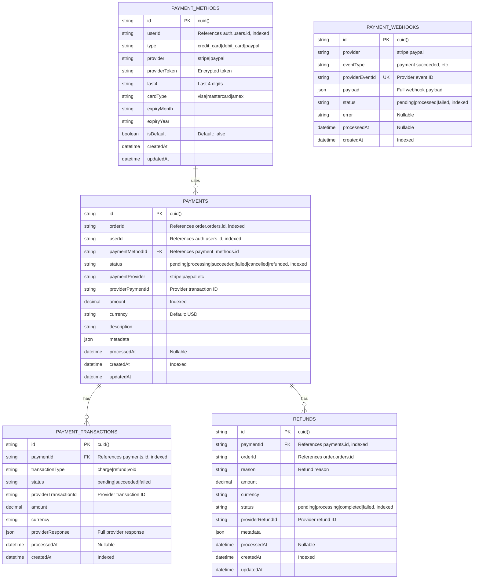

# Payment Service Database Design

## Overview

**Database Name**: `payment_db`  
**Service**: Payment Service  
**Purpose**: Payment processing, transactions, refunds, payment methods  
**Technology**: PostgreSQL 15+  
**ORM**: Prisma

---

## ER Diagram



---

## Table Specifications

### 1. `payments` Table

**Purpose**: Payment records linked to orders

**Columns**:

| Column | Type | Constraints | Description |
|--------|------|-------------|-------------|
| `id` | VARCHAR(25) | PRIMARY KEY, DEFAULT cuid() | Unique payment identifier |
| `order_id` | VARCHAR(25) | NOT NULL, INDEXED | References order-service `orders.id` (no FK constraint) |
| `user_id` | VARCHAR(25) | NOT NULL, INDEXED | References auth-service `users.id` (no FK constraint) |
| `payment_method_id` | VARCHAR(25) | FOREIGN KEY → payment_methods.id, NULLABLE | Payment method identifier |
| `status` | VARCHAR(20) | DEFAULT 'pending', INDEXED | Payment status (pending, processing, succeeded, failed, cancelled, refunded) |
| `payment_provider` | VARCHAR(50) | NOT NULL | Payment provider (stripe, paypal, etc.) |
| `provider_payment_id` | VARCHAR(255) | NULLABLE | Provider transaction ID |
| `amount` | DECIMAL(10,2) | NOT NULL, INDEXED | Payment amount |
| `currency` | VARCHAR(3) | DEFAULT 'USD' | Currency code (ISO 4217) |
| `description` | VARCHAR(500) | NULLABLE | Payment description |
| `metadata` | JSONB | NULLABLE | Additional payment data |
| `processed_at` | TIMESTAMP | NULLABLE | Processing completion timestamp |
| `created_at` | TIMESTAMP | DEFAULT now(), INDEXED | Creation timestamp |
| `updated_at` | TIMESTAMP | DEFAULT now(), ON UPDATE now() | Last update timestamp |

**Indexes**:
- Primary Key: `id`
- Index: `order_id` (for order payment queries)
- Index: `user_id` (for user payment queries)
- Index: `status` (for status filtering)
- Index: `amount` (for payment value queries)
- Index: `created_at` (for time-based queries)
- Composite Index: `(user_id, status, created_at)` (for user payment history)
- Composite Index: `(status, created_at)` (for payment processing)

**Cross-Service References**:
- `order_id` references `order.orders.id` (logical reference, no FK constraint)
- `user_id` references `auth.users.id` (logical reference, no FK constraint)

**Foreign Keys**:
- `payment_method_id` → `payment_methods.id` (SET NULL on delete)

**Payment Status Flow**:
```
pending → processing → succeeded
  ↓           ↓
failed    cancelled
  ↓
refunded
```

**Production Considerations**:
- **Idempotency**: Use `provider_payment_id` for idempotency
- **Retry Logic**: Retry failed payments with exponential backoff
- **Webhook Processing**: Process provider webhooks asynchronously

---

### 2. `payment_transactions` Table

**Purpose**: Detailed transaction history (charges, refunds, voids)

**Columns**:

| Column | Type | Constraints | Description |
|--------|------|-------------|-------------|
| `id` | VARCHAR(25) | PRIMARY KEY, DEFAULT cuid() | Unique transaction identifier |
| `payment_id` | VARCHAR(25) | FOREIGN KEY → payments.id, INDEXED | Payment identifier |
| `transaction_type` | VARCHAR(20) | NOT NULL | Transaction type (charge, refund, void) |
| `status` | VARCHAR(20) | NOT NULL | Transaction status (pending, succeeded, failed) |
| `provider_transaction_id` | VARCHAR(255) | NULLABLE | Provider transaction ID |
| `amount` | DECIMAL(10,2) | NOT NULL | Transaction amount |
| `currency` | VARCHAR(3) | NOT NULL | Currency code |
| `provider_response` | JSONB | NULLABLE | Full provider API response |
| `processed_at` | TIMESTAMP | NULLABLE | Processing completion timestamp |
| `created_at` | TIMESTAMP | DEFAULT now(), INDEXED | Creation timestamp |

**Indexes**:
- Primary Key: `id`
- Index: `payment_id` (for payment transaction queries)
- Index: `created_at` (for time-based queries)
- Composite Index: `(payment_id, created_at)` (for ordered transactions)

**Foreign Keys**:
- `payment_id` → `payments.id` (CASCADE DELETE)

**Purpose**:
- **Audit Trail**: Complete transaction history
- **Debugging**: Full provider responses stored
- **Reconciliation**: Match with provider statements

---

### 3. `refunds` Table

**Purpose**: Refund records

**Columns**:

| Column | Type | Constraints | Description |
|--------|------|-------------|-------------|
| `id` | VARCHAR(25) | PRIMARY KEY, DEFAULT cuid() | Unique refund identifier |
| `payment_id` | VARCHAR(25) | FOREIGN KEY → payments.id, INDEXED | Payment identifier |
| `order_id` | VARCHAR(25) | NOT NULL | References order-service `orders.id` (no FK constraint) |
| `reason` | VARCHAR(255) | NULLABLE | Refund reason |
| `amount` | DECIMAL(10,2) | NOT NULL | Refund amount |
| `currency` | VARCHAR(3) | NOT NULL | Currency code |
| `status` | VARCHAR(20) | DEFAULT 'pending', INDEXED | Refund status (pending, processing, completed, failed) |
| `provider_refund_id` | VARCHAR(255) | NULLABLE | Provider refund ID |
| `metadata` | JSONB | NULLABLE | Additional refund data |
| `processed_at` | TIMESTAMP | NULLABLE | Processing completion timestamp |
| `created_at` | TIMESTAMP | DEFAULT now(), INDEXED | Creation timestamp |
| `updated_at` | TIMESTAMP | DEFAULT now(), ON UPDATE now() | Last update timestamp |

**Indexes**:
- Primary Key: `id`
- Index: `payment_id` (for payment refund queries)
- Index: `status` (for status filtering)
- Index: `created_at` (for time-based queries)

**Foreign Keys**:
- `payment_id` → `payments.id` (CASCADE DELETE)

**Cross-Service References**:
- `order_id` references `order.orders.id` (logical reference, no FK constraint)

**Refund Status Flow**:
```
pending → processing → completed
  ↓
failed
```

---

### 4. `payment_methods` Table

**Purpose**: Stored payment methods (tokenized)

**Columns**:

| Column | Type | Constraints | Description |
|--------|------|-------------|-------------|
| `id` | VARCHAR(25) | PRIMARY KEY, DEFAULT cuid() | Unique payment method identifier |
| `user_id` | VARCHAR(25) | NOT NULL, INDEXED | References auth-service `users.id` (no FK constraint) |
| `type` | VARCHAR(20) | NOT NULL | Payment type (credit_card, debit_card, paypal) |
| `provider` | VARCHAR(50) | NOT NULL | Payment provider (stripe, paypal) |
| `provider_token` | VARCHAR(500) | NULLABLE | Encrypted provider token |
| `last4` | VARCHAR(4) | NULLABLE | Last 4 digits (for cards) |
| `card_type` | VARCHAR(20) | NULLABLE | Card type (visa, mastercard, amex) |
| `expiry_month` | VARCHAR(2) | NULLABLE | Expiry month (01-12) |
| `expiry_year` | VARCHAR(4) | NULLABLE | Expiry year (YYYY) |
| `is_default` | BOOLEAN | DEFAULT false | Default payment method flag |
| `created_at` | TIMESTAMP | DEFAULT now() | Creation timestamp |
| `updated_at` | TIMESTAMP | DEFAULT now(), ON UPDATE now() | Last update timestamp |

**Indexes**:
- Primary Key: `id`
- Index: `user_id` (for user payment method queries)

**Cross-Service References**:
- `user_id` references `auth.users.id` (logical reference, no FK constraint)

**Security Considerations**:
- **PCI Compliance**: Only store tokenized data
- **Encryption**: Encrypt `provider_token` at application level
- **No Full Card Data**: Never store full card numbers or CVV

**Note**: This table duplicates data from `user-service.payment_methods` for payment processing. Consider syncing via events or using user-service as source of truth.

---

### 5. `payment_webhooks` Table

**Purpose**: Webhook logs from payment providers

**Columns**:

| Column | Type | Constraints | Description |
|--------|------|-------------|-------------|
| `id` | VARCHAR(25) | PRIMARY KEY, DEFAULT cuid() | Unique webhook identifier |
| `provider` | VARCHAR(50) | NOT NULL | Payment provider (stripe, paypal) |
| `event_type` | VARCHAR(100) | NOT NULL | Webhook event type |
| `provider_event_id` | VARCHAR(255) | UNIQUE, NOT NULL | Provider event ID (for idempotency) |
| `payload` | JSONB | NOT NULL | Full webhook payload |
| `status` | VARCHAR(20) | DEFAULT 'pending', INDEXED | Processing status (pending, processed, failed) |
| `error` | TEXT | NULLABLE | Error message if processing failed |
| `processed_at` | TIMESTAMP | NULLABLE | Processing completion timestamp |
| `created_at` | TIMESTAMP | DEFAULT now(), INDEXED | Webhook received timestamp |

**Indexes**:
- Primary Key: `id`
- Unique Index: `provider_event_id` (for idempotency)
- Index: `status` (for status filtering)
- Index: `created_at` (for time-based queries)

**Purpose**:
- **Idempotency**: Prevent duplicate webhook processing
- **Debugging**: Full webhook payload stored
- **Retry Logic**: Identify failed webhooks for retry

**Common Event Types**:
- `payment.succeeded` - Payment completed
- `payment.failed` - Payment failed
- `payment.refunded` - Refund processed
- `charge.dispute.created` - Chargeback/dispute created

---

## Indexing Strategy

### Primary Indexes
- All primary keys (automatic)

### Performance Indexes
- `payments.order_id` - Order payment queries
- `payments.user_id` - User payment queries
- `payments.status` - Status filtering
- `payments.amount` - Payment value queries
- `payments.created_at` - Time-based queries
- `payment_transactions.payment_id` - Payment transaction queries
- `refunds.payment_id` - Payment refund queries
- `refunds.status` - Refund status filtering
- `payment_webhooks.provider_event_id` - Idempotency checks

### Composite Indexes
- `payments(user_id, status, created_at)` - User payment history
- `payments(status, created_at)` - Payment processing queue
- `payment_transactions(payment_id, created_at)` - Ordered transactions

---

## Production Optimizations

### 1. Payment Processing

**Idempotency**:
```typescript
// Check if payment already exists
const existing = await paymentRepository.findByProviderPaymentId(
  providerPaymentId
);
if (existing) {
  return existing; // Return existing payment
}

// Create new payment
const payment = await paymentRepository.create({
  orderId,
  userId,
  providerPaymentId,
  // ...
});
```

**Retry Logic**:
```typescript
// Retry failed payments with exponential backoff
async function retryFailedPayment(paymentId: string) {
  const maxRetries = 3;
  let retryCount = 0;
  
  while (retryCount < maxRetries) {
    try {
      await processPayment(paymentId);
      break;
    } catch (error) {
      retryCount++;
      await sleep(Math.pow(2, retryCount) * 1000); // Exponential backoff
    }
  }
}
```

### 2. Webhook Processing

**Idempotency**:
```typescript
// Check if webhook already processed
const existing = await webhookRepository.findByProviderEventId(
  providerEventId
);
if (existing && existing.status === 'processed') {
  return; // Already processed
}

// Process webhook
await processWebhook(webhook);
```

**Webhook Verification**:
```typescript
// Verify webhook signature (Stripe example)
const signature = req.headers['stripe-signature'];
const isValid = stripe.webhooks.constructEvent(
  payload,
  signature,
  webhookSecret
);
```

### 3. Reconciliation

**Daily Reconciliation**:
```sql
-- Match payments with provider transactions
SELECT 
  p.id,
  p.provider_payment_id,
  p.amount,
  pt.provider_transaction_id,
  pt.amount as transaction_amount
FROM payments p
LEFT JOIN payment_transactions pt ON p.id = pt.payment_id
WHERE p.status = 'succeeded'
AND p.processed_at >= CURRENT_DATE - INTERVAL '1 day';
```

### 4. Backup Strategy

**Automated Backups**:
- Daily full backups at 2 AM UTC
- Hourly incremental backups
- Point-in-time recovery (PITR) enabled
- Cross-region backup replication

**Retention**:
- Daily backups: 30 days
- Weekly backups: 12 weeks
- Monthly backups: 12 months

### 5. Monitoring

**Key Metrics**:
- Payment success rate
- Payment processing time
- Refund rate
- Failed payment rate
- Webhook processing latency

**Alerts**:
- Payment success rate < 95%
- Failed payment rate > 5%
- Webhook processing failures
- Reconciliation mismatches

---

## Security Considerations

### 1. PCI Compliance

- **Tokenization**: Use payment provider tokens only
- **Encryption**: Encrypt `provider_token` field
- **No Card Data**: Never store full card numbers or CVV
- **Access Control**: Limit access to payment data

### 2. Data Protection

- **PII**: Payments contain user and order data
- **Access Control**: Users can only access their own payments
- **Admin Access**: Admins can access all payments via RBAC

### 3. Webhook Security

- **Signature Verification**: Verify webhook signatures
- **Idempotency**: Prevent duplicate webhook processing
- **Rate Limiting**: Limit webhook processing rate

---

## Event Processing

### Published Events

**Payment Succeeded**:
```typescript
{
  eventType: 'payment.succeeded',
  paymentId: 'cm123...',
  orderId: 'cm456...',
  userId: 'cm789...',
  amount: 99.99,
  currency: 'USD',
  // ...
}
```

**Payment Failed**:
```typescript
{
  eventType: 'payment.failed',
  paymentId: 'cm123...',
  orderId: 'cm456...',
  userId: 'cm789...',
  error: 'Insufficient funds',
  // ...
}
```

### Consumed Events

**From Order Service**:
- `order.created` - Create payment record
- `order.cancelled` - Cancel payment

---

## Estimated Capacity

### Current Scale (Production)

- **Payments**: 10,000,000
- **Payment Transactions**: 15,000,000
- **Refunds**: 500,000
- **Payment Methods**: 2,000,000
- **Payment Webhooks**: 20,000,000

### Growth Projections

- **New Payments**: 100,000/month
- **New Transactions**: 150,000/month
- **New Refunds**: 5,000/month

### Storage Estimates

- **Database Size**: ~150 GB
- **Monthly Growth**: ~15 GB
- **Index Size**: ~30 GB

---

## Next Steps

- View [Notification Service Database](./06-notification-service-database.md)
- View [Cross-Service References](./08-cross-service-references.md)
- Return to [Database Architecture Overview](./README.md)

