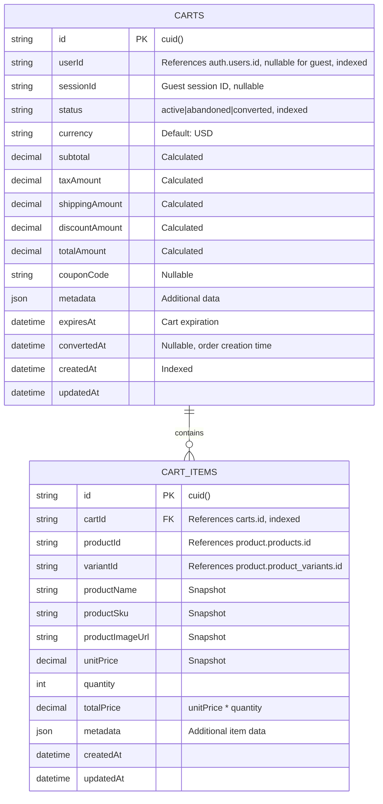

# Cart Service Database Design

## Overview

**Database Name**: `cart_db`  
**Service**: Cart Service  
**Purpose**: Shopping cart management, cart items, cart persistence  
**Technology**: PostgreSQL 15+  
**ORM**: Prisma

---

## ER Diagram



---

## Table Specifications

### 1. `carts` Table

**Purpose**: Shopping cart headers

**Columns**:

| Column | Type | Constraints | Description |
|--------|------|-------------|-------------|
| `id` | VARCHAR(25) | PRIMARY KEY, DEFAULT cuid() | Unique cart identifier |
| `user_id` | VARCHAR(25) | NULLABLE, INDEXED | References auth-service `users.id` (authenticated users) |
| `session_id` | VARCHAR(255) | NULLABLE, INDEXED | Guest session ID (for anonymous users) |
| `status` | VARCHAR(20) | DEFAULT 'active', INDEXED | Cart status (active, abandoned, converted) |
| `currency` | VARCHAR(3) | DEFAULT 'USD' | Currency code (ISO 4217) |
| `subtotal` | DECIMAL(10,2) | DEFAULT 0 | Subtotal before tax, shipping, discount |
| `tax_amount` | DECIMAL(10,2) | DEFAULT 0 | Tax amount |
| `shipping_amount` | DECIMAL(10,2) | DEFAULT 0 | Shipping cost |
| `discount_amount` | DECIMAL(10,2) | DEFAULT 0 | Discount amount |
| `total_amount` | DECIMAL(10,2) | DEFAULT 0 | Total cart amount |
| `coupon_code` | VARCHAR(50) | NULLABLE | Applied coupon code |
| `metadata` | JSONB | NULLABLE | Additional cart data |
| `expires_at` | TIMESTAMP | NULLABLE | Cart expiration timestamp |
| `converted_at` | TIMESTAMP | NULLABLE | Order creation timestamp (when cart converted to order) |
| `created_at` | TIMESTAMP | DEFAULT now(), INDEXED | Creation timestamp |
| `updated_at` | TIMESTAMP | DEFAULT now(), ON UPDATE now() | Last update timestamp |

**Indexes**:
- Primary Key: `id`
- Index: `user_id` (for authenticated user carts)
- Index: `session_id` (for guest carts)
- Index: `status` (for status filtering)
- Index: `expires_at` (for cleanup queries)
- Index: `created_at` (for time-based queries)
- Composite Index: `(user_id, status)` (for user active carts)
- Composite Index: `(session_id, status)` (for guest active carts)

**Cross-Service References**:
- `user_id` references `auth.users.id` (logical reference, no FK constraint)

**Business Rules**:
- Either `user_id` OR `session_id` must be set (not both)
- Cart expires after 30 days of inactivity (default)
- Cart status changes: `active` → `abandoned` (after expiration) or `converted` (when order created)

**Cart Status Flow**:
```
active → converted (when order created)
  ↓
abandoned (after expiration)
```

**Production Considerations**:
- **Guest Carts**: Use `session_id` for anonymous users
- **Cart Expiration**: Default 30 days, configurable
- **Cleanup Job**: Delete abandoned carts older than 90 days
- **Cart Merging**: Merge guest cart with user cart on login

---

### 2. `cart_items` Table

**Purpose**: Cart line items (products in cart)

**Columns**:

| Column | Type | Constraints | Description |
|--------|------|-------------|-------------|
| `id` | VARCHAR(25) | PRIMARY KEY, DEFAULT cuid() | Unique item identifier |
| `cart_id` | VARCHAR(25) | FOREIGN KEY → carts.id, INDEXED | Cart identifier |
| `product_id` | VARCHAR(25) | NOT NULL | References product-service `products.id` (no FK constraint) |
| `variant_id` | VARCHAR(25) | NULLABLE | References product-service `product_variants.id` (no FK constraint) |
| `product_name` | VARCHAR(255) | NOT NULL | Product name snapshot |
| `product_sku` | VARCHAR(100) | NOT NULL | Product SKU snapshot |
| `product_image_url` | VARCHAR(500) | NULLABLE | Product image URL snapshot |
| `unit_price` | DECIMAL(10,2) | NOT NULL | Price per unit at time of adding |
| `quantity` | INTEGER | NOT NULL | Quantity in cart |
| `total_price` | DECIMAL(10,2) | NOT NULL | Total price (unit_price × quantity) |
| `metadata` | JSONB | NULLABLE | Additional item data (selected options, etc.) |
| `created_at` | TIMESTAMP | DEFAULT now() | Creation timestamp |
| `updated_at` | TIMESTAMP | DEFAULT now(), ON UPDATE now() | Last update timestamp |

**Indexes**:
- Primary Key: `id`
- Index: `cart_id` (for cart item queries)
- Index: `product_id` (for product popularity queries)
- Unique Constraint: `(cart_id, product_id, variant_id)` (prevent duplicates)

**Foreign Keys**:
- `cart_id` → `carts.id` (CASCADE DELETE)

**Cross-Service References**:
- `product_id` references `product.products.id` (logical reference, no FK constraint)
- `variant_id` references `product.product_variants.id` (logical reference, no FK constraint)

**Snapshot Pattern**:
- Product data is **snapshot** at add-to-cart time
- Prevents issues if product is updated/deleted
- Ensures cart consistency

**Business Rules**:
- Maximum quantity per item: 99 (configurable)
- Minimum quantity per item: 1
- Duplicate items (same product + variant) update quantity instead of creating new item

---

## Indexing Strategy

### Primary Indexes
- All primary keys (automatic)

### Performance Indexes
- `carts.user_id` - Authenticated user cart queries
- `carts.session_id` - Guest cart queries
- `carts.status` - Status filtering
- `carts.expires_at` - Cleanup queries
- `cart_items.cart_id` - Cart item queries
- `cart_items.product_id` - Product popularity queries

### Composite Indexes
- `carts(user_id, status)` - User active carts
- `carts(session_id, status)` - Guest active carts
- `cart_items(cart_id, product_id, variant_id)` - Unique constraint

---

## Production Optimizations

### 1. Cart Calculation

**Recalculate Cart Totals**:
```typescript
async function recalculateCart(cartId: string) {
  const items = await cartItemRepository.findByCartId(cartId);
  
  const subtotal = items.reduce((sum, item) => sum + item.totalPrice, 0);
  const taxAmount = calculateTax(subtotal);
  const shippingAmount = await calculateShipping(cartId);
  const discountAmount = await calculateDiscount(cartId);
  const totalAmount = subtotal + taxAmount + shippingAmount - discountAmount;
  
  await cartRepository.update(cartId, {
    subtotal,
    taxAmount,
    shippingAmount,
    discountAmount,
    totalAmount,
  });
}
```

### 2. Cart Expiration

**Cleanup Expired Carts**:
```sql
-- Mark expired carts as abandoned
UPDATE carts 
SET status = 'abandoned' 
WHERE status = 'active' 
AND expires_at < NOW();

-- Delete abandoned carts older than 90 days
DELETE FROM carts 
WHERE status = 'abandoned' 
AND updated_at < NOW() - INTERVAL '90 days';
```

### 3. Cart Merging

**Merge Guest Cart with User Cart on Login**:
```typescript
async function mergeCarts(guestSessionId: string, userId: string) {
  const guestCart = await cartRepository.findBySessionId(guestSessionId);
  const userCart = await cartRepository.findByUserId(userId);
  
  if (!guestCart) return;
  
  if (!userCart) {
    // Convert guest cart to user cart
    await cartRepository.update(guestCart.id, { userId, sessionId: null });
    return;
  }
  
  // Merge items from guest cart to user cart
  const guestItems = await cartItemRepository.findByCartId(guestCart.id);
  for (const item of guestItems) {
    await addItemToCart(userCart.id, item);
  }
  
  // Delete guest cart
  await cartRepository.delete(guestCart.id);
}
```

### 4. Caching Strategy

**Redis Caching**:
- Active carts by `user_id` (TTL: 1 hour)
- Active carts by `session_id` (TTL: 1 hour)
- Cart items by `cart_id` (TTL: 1 hour)

**Cache Invalidation**:
- Invalidate on cart update
- Invalidate on item add/remove/update
- Invalidate on cart conversion

### 5. Backup Strategy

**Automated Backups**:
- Daily full backups at 2 AM UTC
- Hourly incremental backups
- Point-in-time recovery (PITR) enabled
- Cross-region backup replication

**Retention**:
- Daily backups: 30 days
- Weekly backups: 12 weeks
- Monthly backups: 12 months

### 6. Monitoring

**Key Metrics**:
- Active cart count
- Cart conversion rate
- Average cart value
- Abandoned cart rate
- Cart expiration rate

**Alerts**:
- Abandoned cart rate > 70%
- Cart conversion rate < 10%
- Cart calculation errors
- Cart expiration job failures

---

## Security Considerations

### 1. Data Protection

- **PII**: Carts contain user data (user_id)
- **Access Control**: Users can only access their own carts
- **Guest Carts**: Protected by session_id

### 2. Cart Security

- **Session Validation**: Validate session_id for guest carts
- **User Validation**: Validate user_id for authenticated carts
- **Rate Limiting**: Limit cart operations per user/session

---

## Event Processing

### Published Events

**Cart Created**:
```typescript
{
  eventType: 'cart.created',
  cartId: 'cm123...',
  userId: 'cm456...',
  // ...
}
```

**Cart Updated**:
```typescript
{
  eventType: 'cart.updated',
  cartId: 'cm123...',
  totalAmount: 99.99,
  // ...
}
```

**Cart Converted**:
```typescript
{
  eventType: 'cart.converted',
  cartId: 'cm123...',
  orderId: 'cm789...',
  // ...
}
```

### Consumed Events

**From Product Service**:
- `product.updated` - Update cart item snapshots (if needed)
- `product.deleted` - Remove items from cart
- `product.price.changed` - Recalculate cart totals

**From Discount Service**:
- `coupon.applied` - Apply discount to cart
- `coupon.removed` - Remove discount from cart

---

## API Endpoints (Reference)

```
POST   /api/v1/carts                    - Create cart
GET    /api/v1/carts/:cartId            - Get cart
PUT    /api/v1/carts/:cartId             - Update cart
DELETE /api/v1/carts/:cartId             - Delete cart
POST   /api/v1/carts/:cartId/items       - Add item to cart
PUT    /api/v1/carts/:cartId/items/:id  - Update cart item
DELETE /api/v1/carts/:cartId/items/:id  - Remove item from cart
POST   /api/v1/carts/:cartId/apply-coupon - Apply coupon
DELETE /api/v1/carts/:cartId/coupon     - Remove coupon
POST   /api/v1/carts/:cartId/convert    - Convert cart to order
```

---

## Estimated Capacity

### Current Scale (Production)

- **Active Carts**: 500,000
- **Cart Items**: 2,000,000 (average 4 per cart)
- **Abandoned Carts**: 5,000,000 (archived)

### Growth Projections

- **New Carts**: 200,000/month
- **New Cart Items**: 800,000/month
- **Cart Conversions**: 20,000/month (10% conversion rate)

### Storage Estimates

- **Database Size**: ~50 GB
- **Monthly Growth**: ~5 GB
- **Index Size**: ~10 GB

---

## Next Steps

- View [Discount Service Database](./07-discount-service-database.md)
- View [Cross-Service References](./08-cross-service-references.md)
- Return to [Database Architecture Overview](./README.md)

