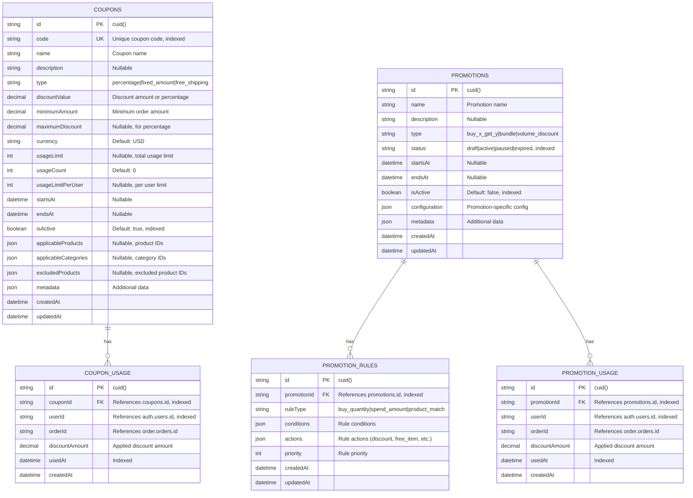

# Discount/Promotion Service Database Design

## Overview

**Database Name**: `discount_db`  
**Service**: Discount/Promotion Service  
**Purpose**: Coupon codes, promotional campaigns, discount rules, usage tracking  
**Technology**: PostgreSQL 15+  
**ORM**: Prisma

---

## ER Diagram



---

## Table Specifications

### 1. `coupons` Table

**Purpose**: Coupon code definitions and management

**Columns**:

| Column | Type | Constraints | Description |
|--------|------|-------------|-------------|
| `id` | VARCHAR(25) | PRIMARY KEY, DEFAULT cuid() | Unique coupon identifier |
| `code` | VARCHAR(50) | UNIQUE, NOT NULL, INDEXED | Coupon code (e.g., "SAVE20", "WELCOME10") |
| `name` | VARCHAR(255) | NOT NULL | Coupon name |
| `description` | TEXT | NULLABLE | Coupon description |
| `type` | VARCHAR(20) | NOT NULL | Discount type (percentage, fixed_amount, free_shipping) |
| `discount_value` | DECIMAL(10,2) | NOT NULL | Discount amount or percentage |
| `minimum_amount` | DECIMAL(10,2) | DEFAULT 0 | Minimum order amount required |
| `maximum_discount` | DECIMAL(10,2) | NULLABLE | Maximum discount amount (for percentage coupons) |
| `currency` | VARCHAR(3) | DEFAULT 'USD' | Currency code (ISO 4217) |
| `usage_limit` | INTEGER | NULLABLE | Total usage limit (null = unlimited) |
| `usage_count` | INTEGER | DEFAULT 0 | Current usage count |
| `usage_limit_per_user` | INTEGER | NULLABLE | Usage limit per user (null = unlimited) |
| `starts_at` | TIMESTAMP | NULLABLE | Coupon start date/time |
| `ends_at` | TIMESTAMP | NULLABLE | Coupon expiration date/time |
| `is_active` | BOOLEAN | DEFAULT true, INDEXED | Active status |
| `applicable_products` | JSONB | NULLABLE | Array of product IDs (null = all products) |
| `applicable_categories` | JSONB | NULLABLE | Array of category IDs (null = all categories) |
| `excluded_products` | JSONB | NULLABLE | Array of excluded product IDs |
| `metadata` | JSONB | NULLABLE | Additional coupon data |
| `created_at` | TIMESTAMP | DEFAULT now() | Creation timestamp |
| `updated_at` | TIMESTAMP | DEFAULT now(), ON UPDATE now() | Last update timestamp |

**Indexes**:
- Primary Key: `id`
- Unique Index: `code` (for coupon lookup)
- Index: `is_active` (for active coupon queries)
- Index: `starts_at` (for start date filtering)
- Index: `ends_at` (for expiration queries)

**Coupon Types**:
- `percentage` - Percentage discount (e.g., 20% off)
- `fixed_amount` - Fixed amount discount (e.g., $10 off)
- `free_shipping` - Free shipping discount

**Business Rules**:
- Coupon must be active (`is_active = true`)
- Current time must be between `starts_at` and `ends_at` (if set)
- `usage_count` must be less than `usage_limit` (if set)
- Order amount must be >= `minimum_amount`
- For percentage coupons: discount = min(`discount_value`%, `maximum_discount`)

**Production Considerations**:
- **Code Generation**: Generate unique, user-friendly codes
- **Validation**: Validate coupon before applying
- **Usage Tracking**: Track usage per user and globally

---

### 2. `coupon_usage` Table

**Purpose**: Track coupon usage for validation and analytics

**Columns**:

| Column | Type | Constraints | Description |
|--------|------|-------------|-------------|
| `id` | VARCHAR(25) | PRIMARY KEY, DEFAULT cuid() | Unique usage record identifier |
| `coupon_id` | VARCHAR(25) | FOREIGN KEY → coupons.id, INDEXED | Coupon identifier |
| `user_id` | VARCHAR(25) | NULLABLE, INDEXED | References auth-service `users.id` (nullable for guest usage) |
| `order_id` | VARCHAR(25) | NULLABLE | References order-service `orders.id` (when order created) |
| `discount_amount` | DECIMAL(10,2) | NOT NULL | Applied discount amount |
| `used_at` | TIMESTAMP | DEFAULT now(), INDEXED | Usage timestamp |
| `created_at` | TIMESTAMP | DEFAULT now() | Creation timestamp |

**Indexes**:
- Primary Key: `id`
- Index: `coupon_id` (for coupon usage queries)
- Index: `user_id` (for user usage queries)
- Index: `used_at` (for time-based queries)
- Composite Index: `(coupon_id, user_id)` (for per-user usage validation)
- Composite Index: `(coupon_id, used_at)` (for coupon usage analytics)

**Foreign Keys**:
- `coupon_id` → `coupons.id` (CASCADE DELETE)

**Cross-Service References**:
- `user_id` references `auth.users.id` (logical reference, no FK constraint)
- `order_id` references `order.orders.id` (logical reference, no FK constraint)

**Purpose**:
- **Validation**: Check if user has already used coupon
- **Analytics**: Track coupon performance
- **Audit**: Track coupon usage history

---

### 3. `promotions` Table

**Purpose**: Promotional campaign definitions

**Columns**:

| Column | Type | Constraints | Description |
|--------|------|-------------|-------------|
| `id` | VARCHAR(25) | PRIMARY KEY, DEFAULT cuid() | Unique promotion identifier |
| `name` | VARCHAR(255) | NOT NULL | Promotion name |
| `description` | TEXT | NULLABLE | Promotion description |
| `type` | VARCHAR(50) | NOT NULL | Promotion type (buy_x_get_y, bundle, volume_discount) |
| `status` | VARCHAR(20) | DEFAULT 'draft', INDEXED | Promotion status (draft, active, paused, expired) |
| `starts_at` | TIMESTAMP | NULLABLE | Promotion start date/time |
| `ends_at` | TIMESTAMP | NULLABLE | Promotion expiration date/time |
| `is_active` | BOOLEAN | DEFAULT false, INDEXED | Active status |
| `configuration` | JSONB | NOT NULL | Promotion-specific configuration |
| `metadata` | JSONB | NULLABLE | Additional promotion data |
| `created_at` | TIMESTAMP | DEFAULT now() | Creation timestamp |
| `updated_at` | TIMESTAMP | DEFAULT now(), ON UPDATE now() | Last update timestamp |

**Indexes**:
- Primary Key: `id`
- Index: `status` (for status filtering)
- Index: `is_active` (for active promotion queries)
- Index: `starts_at` (for start date filtering)
- Index: `ends_at` (for expiration queries)

**Promotion Types**:
- `buy_x_get_y` - Buy X items, get Y free
- `bundle` - Bundle discount (buy multiple items together)
- `volume_discount` - Volume-based discount (buy 3+ items, get 10% off)

**Configuration Examples**:

**Buy X Get Y**:
```json
{
  "buyQuantity": 2,
  "getQuantity": 1,
  "getProductId": "cm123...",
  "discountType": "free"
}
```

**Volume Discount**:
```json
{
  "minQuantity": 3,
  "discountType": "percentage",
  "discountValue": 10
}
```

---

### 4. `promotion_rules` Table

**Purpose**: Promotion rule definitions (conditions and actions)

**Columns**:

| Column | Type | Constraints | Description |
|--------|------|-------------|-------------|
| `id` | VARCHAR(25) | PRIMARY KEY, DEFAULT cuid() | Unique rule identifier |
| `promotion_id` | VARCHAR(25) | FOREIGN KEY → promotions.id, INDEXED | Promotion identifier |
| `rule_type` | VARCHAR(50) | NOT NULL | Rule type (buy_quantity, spend_amount, product_match) |
| `conditions` | JSONB | NOT NULL | Rule conditions |
| `actions` | JSONB | NOT NULL | Rule actions (discount, free_item, etc.) |
| `priority` | INTEGER | DEFAULT 0 | Rule priority (higher = evaluated first) |
| `created_at` | TIMESTAMP | DEFAULT now() | Creation timestamp |
| `updated_at` | TIMESTAMP | DEFAULT now(), ON UPDATE now() | Last update timestamp |

**Indexes**:
- Primary Key: `id`
- Index: `promotion_id` (for promotion rule queries)
- Composite Index: `(promotion_id, priority)` (for ordered rule evaluation)

**Foreign Keys**:
- `promotion_id` → `promotions.id` (CASCADE DELETE)

**Rule Types**:
- `buy_quantity` - Buy specific quantity
- `spend_amount` - Spend specific amount
- `product_match` - Match specific products
- `category_match` - Match specific categories

**Conditions Example**:
```json
{
  "type": "buy_quantity",
  "productIds": ["cm123..."],
  "quantity": 2
}
```

**Actions Example**:
```json
{
  "type": "discount",
  "discountType": "percentage",
  "discountValue": 20
}
```

---

### 5. `promotion_usage` Table

**Purpose**: Track promotion usage for analytics

**Columns**:

| Column | Type | Constraints | Description |
|--------|------|-------------|-------------|
| `id` | VARCHAR(25) | PRIMARY KEY, DEFAULT cuid() | Unique usage record identifier |
| `promotion_id` | VARCHAR(25) | FOREIGN KEY → promotions.id, INDEXED | Promotion identifier |
| `user_id` | VARCHAR(25) | NULLABLE, INDEXED | References auth-service `users.id` (nullable for guest usage) |
| `order_id` | VARCHAR(25) | NULLABLE | References order-service `orders.id` |
| `discount_amount` | DECIMAL(10,2) | NOT NULL | Applied discount amount |
| `used_at` | TIMESTAMP | DEFAULT now(), INDEXED | Usage timestamp |
| `created_at` | TIMESTAMP | DEFAULT now() | Creation timestamp |

**Indexes**:
- Primary Key: `id`
- Index: `promotion_id` (for promotion usage queries)
- Index: `user_id` (for user usage queries)
- Index: `used_at` (for time-based queries)

**Foreign Keys**:
- `promotion_id` → `promotions.id` (CASCADE DELETE)

**Cross-Service References**:
- `user_id` references `auth.users.id` (logical reference, no FK constraint)
- `order_id` references `order.orders.id` (logical reference, no FK constraint)

---

## Indexing Strategy

### Primary Indexes
- All primary keys (automatic)

### Performance Indexes
- `coupons.code` - Unique index for coupon lookup
- `coupons.is_active` - Active coupon queries
- `coupons.ends_at` - Expiration queries
- `coupon_usage.coupon_id` - Coupon usage queries
- `coupon_usage.user_id` - User usage queries
- `promotions.status` - Status filtering
- `promotions.is_active` - Active promotion queries

### Composite Indexes
- `coupon_usage(coupon_id, user_id)` - Per-user usage validation
- `coupon_usage(coupon_id, used_at)` - Usage analytics
- `promotion_rules(promotion_id, priority)` - Ordered rule evaluation

---

## Production Optimizations

### 1. Coupon Validation

**Validate Coupon**:
```typescript
async function validateCoupon(
  code: string,
  userId: string,
  orderAmount: number
): Promise<{ valid: boolean; discount: number; error?: string }> {
  const coupon = await couponRepository.findByCode(code);
  
  if (!coupon || !coupon.isActive) {
    return { valid: false, discount: 0, error: 'Invalid coupon' };
  }
  
  // Check expiration
  const now = new Date();
  if (coupon.startsAt && now < coupon.startsAt) {
    return { valid: false, discount: 0, error: 'Coupon not yet active' };
  }
  if (coupon.endsAt && now > coupon.endsAt) {
    return { valid: false, discount: 0, error: 'Coupon expired' };
  }
  
  // Check usage limit
  if (coupon.usageLimit && coupon.usageCount >= coupon.usageLimit) {
    return { valid: false, discount: 0, error: 'Coupon usage limit reached' };
  }
  
  // Check minimum amount
  if (orderAmount < coupon.minimumAmount) {
    return { valid: false, discount: 0, error: `Minimum order amount: ${coupon.minimumAmount}` };
  }
  
  // Check per-user usage limit
  if (coupon.usageLimitPerUser) {
    const userUsage = await couponUsageRepository.countByCouponAndUser(
      coupon.id,
      userId
    );
    if (userUsage >= coupon.usageLimitPerUser) {
      return { valid: false, discount: 0, error: 'You have already used this coupon' };
    }
  }
  
  // Calculate discount
  let discount = 0;
  if (coupon.type === 'percentage') {
    discount = (orderAmount * coupon.discountValue) / 100;
    if (coupon.maximumDiscount) {
      discount = Math.min(discount, coupon.maximumDiscount);
    }
  } else if (coupon.type === 'fixed_amount') {
    discount = coupon.discountValue;
  } else if (coupon.type === 'free_shipping') {
    discount = await calculateShippingCost(orderId);
  }
  
  return { valid: true, discount };
}
```

### 2. Promotion Evaluation

**Evaluate Promotion Rules**:
```typescript
async function evaluatePromotion(
  promotionId: string,
  cartItems: CartItem[]
): Promise<{ applicable: boolean; discount: number }> {
  const promotion = await promotionRepository.findById(promotionId);
  if (!promotion || !promotion.isActive) {
    return { applicable: false, discount: 0 };
  }
  
  const rules = await promotionRuleRepository.findByPromotionId(
    promotionId
  );
  rules.sort((a, b) => b.priority - a.priority); // Higher priority first
  
  for (const rule of rules) {
    if (evaluateConditions(rule.conditions, cartItems)) {
      const discount = applyActions(rule.actions, cartItems);
      return { applicable: true, discount };
    }
  }
  
  return { applicable: false, discount: 0 };
}
```

### 3. Caching Strategy

**Redis Caching**:
- Active coupons by `code` (TTL: 1 hour)
- Active promotions (TTL: 1 hour)
- Coupon usage counts (TTL: 15 minutes)

**Cache Invalidation**:
- Invalidate on coupon update
- Invalidate on promotion update
- Invalidate on coupon usage

### 4. Backup Strategy

**Automated Backups**:
- Daily full backups at 2 AM UTC
- Hourly incremental backups
- Point-in-time recovery (PITR) enabled
- Cross-region backup replication

**Retention**:
- Daily backups: 30 days
- Weekly backups: 12 weeks
- Monthly backups: 12 months

### 5. Monitoring

**Key Metrics**:
- Coupon usage rate
- Promotion usage rate
- Average discount amount
- Coupon redemption rate
- Promotion conversion rate

**Alerts**:
- Coupon usage limit reached
- Promotion expiration approaching
- Invalid coupon usage attempts
- Discount calculation errors

---

## Security Considerations

### 1. Data Protection

- **PII**: Coupon usage contains user data
- **Access Control**: Admin-only coupon creation/modification
- **Validation**: Always validate coupons server-side

### 2. Coupon Security

- **Code Generation**: Use secure random generation
- **Rate Limiting**: Limit coupon validation attempts
- **Fraud Prevention**: Monitor for coupon abuse

---

## Event Processing

### Published Events

**Coupon Applied**:
```typescript
{
  eventType: 'coupon.applied',
  couponId: 'cm123...',
  couponCode: 'SAVE20',
  userId: 'cm456...',
  orderId: 'cm789...',
  discountAmount: 20.00,
  // ...
}
```

**Promotion Applied**:
```typescript
{
  eventType: 'promotion.applied',
  promotionId: 'cm123...',
  userId: 'cm456...',
  orderId: 'cm789...',
  discountAmount: 15.00,
  // ...
}
```

### Consumed Events

**From Order Service**:
- `order.created` - Track coupon/promotion usage
- `order.cancelled` - Reverse coupon/promotion usage

---

## Estimated Capacity

### Current Scale (Production)

- **Coupons**: 10,000
- **Coupon Usage**: 1,000,000
- **Promotions**: 500
- **Promotion Usage**: 500,000

### Growth Projections

- **New Coupons**: 100/month
- **New Coupon Usage**: 50,000/month
- **New Promotions**: 10/month

### Storage Estimates

- **Database Size**: ~20 GB
- **Monthly Growth**: ~2 GB
- **Index Size**: ~5 GB

---

## Next Steps

- View [Shipping Service Database](./08-shipping-service-database.md)
- View [Cross-Service References](./08-cross-service-references.md)
- Return to [Database Architecture Overview](./README.md)

