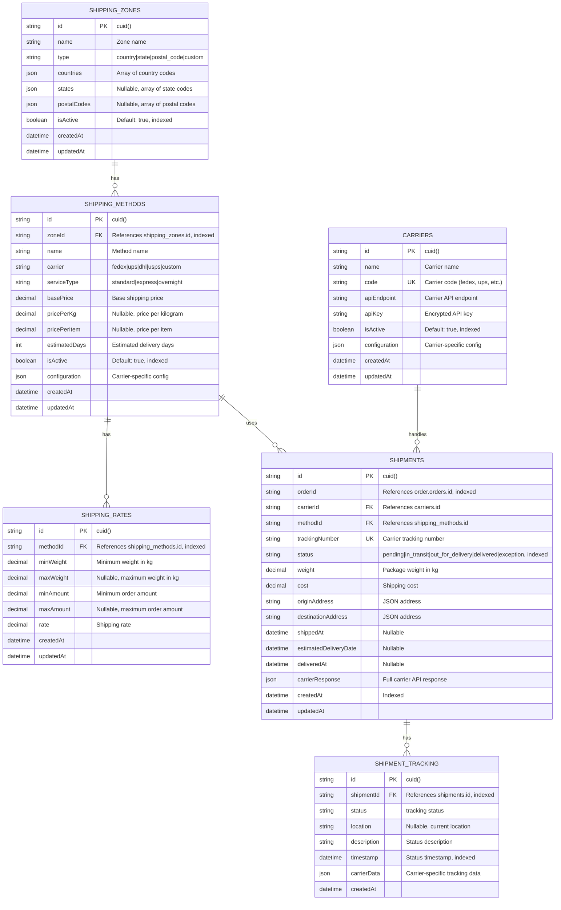

# Shipping Service Database Design

## Overview

**Database Name**: `shipping_db`  
**Service**: Shipping Service  
**Purpose**: Shipping rate calculation, carrier integration, shipping zones, tracking  
**Technology**: PostgreSQL 16+  
**ORM**: Prisma

---

## ER Diagram



---

## Table Specifications

### 1. `shipping_zones` Table

**Purpose**: Shipping zones (geographic areas for shipping)

**Columns**:

| Column | Type | Constraints | Description |
|--------|------|-------------|-------------|
| `id` | VARCHAR(25) | PRIMARY KEY, DEFAULT cuid() | Unique zone identifier |
| `name` | VARCHAR(255) | NOT NULL | Zone name (e.g., "United States", "Europe") |
| `type` | VARCHAR(20) | NOT NULL | Zone type (country, state, postal_code, custom) |
| `countries` | JSONB | NOT NULL | Array of country codes (ISO 3166-1 alpha-2) |
| `states` | JSONB | NULLABLE | Array of state/province codes |
| `postal_codes` | JSONB | NULLABLE | Array of postal code patterns |
| `is_active` | BOOLEAN | DEFAULT true, INDEXED | Active status |
| `created_at` | TIMESTAMP | DEFAULT now() | Creation timestamp |
| `updated_at` | TIMESTAMP | DEFAULT now(), ON UPDATE now() | Last update timestamp |

**Indexes**:
- Primary Key: `id`
- Index: `is_active` (for active zone queries)

**Zone Types**:
- `country` - Country-based zones
- `state` - State/province-based zones
- `postal_code` - Postal code-based zones
- `custom` - Custom zone definitions

**Countries Example**:
```json
["US", "CA", "MX"]
```

**Postal Codes Example**:
```json
["10001", "10002", "10*"] // Wildcard support
```

---

### 2. `shipping_methods` Table

**Purpose**: Shipping methods available in each zone

**Columns**:

| Column | Type | Constraints | Description |
|--------|------|-------------|-------------|
| `id` | VARCHAR(25) | PRIMARY KEY, DEFAULT cuid() | Unique method identifier |
| `zone_id` | VARCHAR(25) | FOREIGN KEY → shipping_zones.id, INDEXED | Zone identifier |
| `name` | VARCHAR(255) | NOT NULL | Method name (e.g., "Standard Shipping", "Express") |
| `carrier` | VARCHAR(50) | NOT NULL | Carrier name (fedex, ups, dhl, usps, custom) |
| `service_type` | VARCHAR(50) | NOT NULL | Service type (standard, express, overnight) |
| `base_price` | DECIMAL(10,2) | DEFAULT 0 | Base shipping price |
| `price_per_kg` | DECIMAL(10,2) | NULLABLE | Price per kilogram |
| `price_per_item` | DECIMAL(10,2) | NULLABLE | Price per item |
| `estimated_days` | INTEGER | NULLABLE | Estimated delivery days |
| `is_active` | BOOLEAN | DEFAULT true, INDEXED | Active status |
| `configuration` | JSONB | NULLABLE | Carrier-specific configuration |
| `created_at` | TIMESTAMP | DEFAULT now() | Creation timestamp |
| `updated_at` | TIMESTAMP | DEFAULT now(), ON UPDATE now() | Last update timestamp |

**Indexes**:
- Primary Key: `id`
- Index: `zone_id` (for zone method queries)
- Index: `is_active` (for active method queries)

**Foreign Keys**:
- `zone_id` → `shipping_zones.id` (CASCADE DELETE)

**Carriers**:
- `fedex` - FedEx
- `ups` - UPS
- `dhl` - DHL
- `usps` - USPS
- `custom` - Custom/local carrier

**Configuration Example**:
```json
{
  "fedexServiceCode": "STANDARD_OVERNIGHT",
  "packagingType": "YOUR_PACKAGING",
  "dropoffType": "REGULAR_PICKUP"
}
```

---

### 3. `shipping_rates` Table

**Purpose**: Shipping rate tiers (weight/amount-based pricing)

**Columns**:

| Column | Type | Constraints | Description |
|--------|------|-------------|-------------|
| `id` | VARCHAR(25) | PRIMARY KEY, DEFAULT cuid() | Unique rate identifier |
| `method_id` | VARCHAR(25) | FOREIGN KEY → shipping_methods.id, INDEXED | Method identifier |
| `min_weight` | DECIMAL(10,2) | DEFAULT 0 | Minimum weight in kg |
| `max_weight` | DECIMAL(10,2) | NULLABLE | Maximum weight in kg (null = unlimited) |
| `min_amount` | DECIMAL(10,2) | DEFAULT 0 | Minimum order amount |
| `max_amount` | DECIMAL(10,2) | NULLABLE | Maximum order amount (null = unlimited) |
| `rate` | DECIMAL(10,2) | NOT NULL | Shipping rate |
| `created_at` | TIMESTAMP | DEFAULT now() | Creation timestamp |
| `updated_at` | TIMESTAMP | DEFAULT now(), ON UPDATE now() | Last update timestamp |

**Indexes**:
- Primary Key: `id`
- Index: `method_id` (for method rate queries)
- Composite Index: `(method_id, min_weight, max_weight)` (for rate lookup)

**Foreign Keys**:
- `method_id` → `shipping_methods.id` (CASCADE DELETE)

**Rate Calculation**:
- Find matching rate based on weight and order amount
- Use first matching rate (ordered by priority)

---

### 4. `shipments` Table

**Purpose**: Shipment records (linked to orders)

**Columns**:

| Column | Type | Constraints | Description |
|--------|------|-------------|-------------|
| `id` | VARCHAR(25) | PRIMARY KEY, DEFAULT cuid() | Unique shipment identifier |
| `order_id` | VARCHAR(25) | NOT NULL, INDEXED | References order-service `orders.id` (no FK constraint) |
| `carrier_id` | VARCHAR(25) | FOREIGN KEY → carriers.id, NULLABLE | Carrier identifier |
| `method_id` | VARCHAR(25) | FOREIGN KEY → shipping_methods.id, NULLABLE | Method identifier |
| `tracking_number` | VARCHAR(100) | UNIQUE, NOT NULL | Carrier tracking number |
| `status` | VARCHAR(50) | DEFAULT 'pending', INDEXED | Shipment status |
| `weight` | DECIMAL(10,2) | NOT NULL | Package weight in kg |
| `cost` | DECIMAL(10,2) | NOT NULL | Shipping cost |
| `origin_address` | JSONB | NOT NULL | Origin address (JSON) |
| `destination_address` | JSONB | NOT NULL | Destination address (JSON) |
| `shipped_at` | TIMESTAMP | NULLABLE | Shipment timestamp |
| `estimated_delivery_date` | TIMESTAMP | NULLABLE | Estimated delivery date |
| `delivered_at` | TIMESTAMP | NULLABLE | Delivery timestamp |
| `carrier_response` | JSONB | NULLABLE | Full carrier API response |
| `created_at` | TIMESTAMP | DEFAULT now(), INDEXED | Creation timestamp |
| `updated_at` | TIMESTAMP | DEFAULT now(), ON UPDATE now() | Last update timestamp |

**Indexes**:
- Primary Key: `id`
- Unique Index: `tracking_number` (for tracking lookup)
- Index: `order_id` (for order shipment queries)
- Index: `status` (for status filtering)
- Index: `created_at` (for time-based queries)

**Foreign Keys**:
- `carrier_id` → `carriers.id` (SET NULL on delete)
- `method_id` → `shipping_methods.id` (SET NULL on delete)

**Cross-Service References**:
- `order_id` references `order.orders.id` (logical reference, no FK constraint)

**Shipment Status Flow**:
```
pending → in_transit → out_for_delivery → delivered
  ↓
exception
```

**Status Values**:
- `pending` - Shipment created, not yet shipped
- `in_transit` - Shipment in transit
- `out_for_delivery` - Out for delivery
- `delivered` - Delivered
- `exception` - Exception/delay

---

### 5. `shipment_tracking` Table

**Purpose**: Shipment tracking history

**Columns**:

| Column | Type | Constraints | Description |
|--------|------|-------------|-------------|
| `id` | VARCHAR(25) | PRIMARY KEY, DEFAULT cuid() | Unique tracking record identifier |
| `shipment_id` | VARCHAR(25) | FOREIGN KEY → shipments.id, INDEXED | Shipment identifier |
| `status` | VARCHAR(50) | NOT NULL | Tracking status |
| `location` | VARCHAR(255) | NULLABLE | Current location |
| `description` | TEXT | NULLABLE | Status description |
| `timestamp` | TIMESTAMP | NOT NULL, INDEXED | Status timestamp |
| `carrier_data` | JSONB | NULLABLE | Carrier-specific tracking data |
| `created_at` | TIMESTAMP | DEFAULT now() | Creation timestamp |

**Indexes**:
- Primary Key: `id`
- Index: `shipment_id` (for shipment tracking queries)
- Index: `timestamp` (for time-based queries)
- Composite Index: `(shipment_id, timestamp)` (for ordered tracking history)

**Foreign Keys**:
- `shipment_id` → `shipments.id` (CASCADE DELETE)

**Purpose**:
- **Tracking History**: Complete tracking history
- **Status Updates**: Real-time status updates
- **Analytics**: Delivery time analytics

---

### 6. `carriers` Table

**Purpose**: Carrier configuration and credentials

**Columns**:

| Column | Type | Constraints | Description |
|--------|------|-------------|-------------|
| `id` | VARCHAR(25) | PRIMARY KEY, DEFAULT cuid() | Unique carrier identifier |
| `name` | VARCHAR(255) | NOT NULL | Carrier name |
| `code` | VARCHAR(50) | UNIQUE, NOT NULL | Carrier code (fedex, ups, etc.) |
| `api_endpoint` | VARCHAR(500) | NOT NULL | Carrier API endpoint |
| `api_key` | VARCHAR(500) | NOT NULL | Encrypted API key |
| `is_active` | BOOLEAN | DEFAULT true, INDEXED | Active status |
| `configuration` | JSONB | NULLABLE | Carrier-specific configuration |
| `created_at` | TIMESTAMP | DEFAULT now() | Creation timestamp |
| `updated_at` | TIMESTAMP | DEFAULT now(), ON UPDATE now() | Last update timestamp |

**Indexes**:
- Primary Key: `id`
- Unique Index: `code` (for carrier lookup)
- Index: `is_active` (for active carrier queries)

**Security Considerations**:
- **API Key Encryption**: Encrypt `api_key` at application level
- **Access Control**: Admin-only carrier configuration
- **Credential Management**: Use AWS Secrets Manager in production

---

## Indexing Strategy

### Primary Indexes
- All primary keys (automatic)

### Performance Indexes
- `shipping_zones.is_active` - Active zone queries
- `shipping_methods.zone_id` - Zone method queries
- `shipping_methods.is_active` - Active method queries
- `shipping_rates.method_id` - Method rate queries
- `shipments.order_id` - Order shipment queries
- `shipments.tracking_number` - Tracking lookup
- `shipments.status` - Status filtering
- `shipment_tracking.shipment_id` - Shipment tracking queries
- `carriers.code` - Carrier lookup

### Composite Indexes
- `shipping_rates(method_id, min_weight, max_weight)` - Rate lookup
- `shipment_tracking(shipment_id, timestamp)` - Ordered tracking history

---

## Production Optimizations

### 1. Shipping Rate Calculation

**Calculate Shipping Rate**:
```typescript
async function calculateShippingRate(
  zoneId: string,
  weight: number,
  orderAmount: number
): Promise<ShippingRate[]> {
  const methods = await shippingMethodRepository.findByZoneId(zoneId);
  const rates: ShippingRate[] = [];
  
  for (const method of methods) {
    if (!method.isActive) continue;
    
    // Find matching rate
    const rate = await shippingRateRepository.findMatchingRate(
      method.id,
      weight,
      orderAmount
    );
    
    if (rate) {
      const totalCost = method.basePrice + 
        (weight * (method.pricePerKg || 0)) +
        rate.rate;
      
      rates.push({
        methodId: method.id,
        methodName: method.name,
        carrier: method.carrier,
        cost: totalCost,
        estimatedDays: method.estimatedDays,
      });
    }
  }
  
  return rates.sort((a, b) => a.cost - b.cost); // Sort by cost
}
```

### 2. Carrier Integration

**Create Shipment via Carrier API**:
```typescript
async function createShipment(
  orderId: string,
  methodId: string
): Promise<Shipment> {
  const method = await shippingMethodRepository.findById(methodId);
  const carrier = await carrierRepository.findByCode(method.carrier);
  const order = await orderServiceClient.getOrder(orderId);
  
  // Call carrier API
  const carrierResponse = await callCarrierAPI(carrier, {
    serviceType: method.serviceType,
    origin: order.originAddress,
    destination: order.destinationAddress,
    weight: order.weight,
    // ...
  });
  
  // Create shipment record
  const shipment = await shipmentRepository.create({
    orderId,
    carrierId: carrier.id,
    methodId: method.id,
    trackingNumber: carrierResponse.trackingNumber,
    status: 'pending',
    weight: order.weight,
    cost: carrierResponse.cost,
    originAddress: order.originAddress,
    destinationAddress: order.destinationAddress,
    estimatedDeliveryDate: carrierResponse.estimatedDeliveryDate,
    carrierResponse: carrierResponse,
  });
  
  return shipment;
}
```

### 3. Tracking Updates

**Update Tracking from Carrier**:
```typescript
async function updateTracking(shipmentId: string) {
  const shipment = await shipmentRepository.findById(shipmentId);
  const carrier = await carrierRepository.findById(shipment.carrierId);
  
  // Call carrier tracking API
  const trackingData = await callCarrierTrackingAPI(
    carrier,
    shipment.trackingNumber
  );
  
  // Update shipment status
  await shipmentRepository.update(shipmentId, {
    status: trackingData.status,
    deliveredAt: trackingData.deliveredAt,
  });
  
  // Add tracking history
  await shipmentTrackingRepository.create({
    shipmentId,
    status: trackingData.status,
    location: trackingData.location,
    description: trackingData.description,
    timestamp: trackingData.timestamp,
    carrierData: trackingData,
  });
}
```

### 4. Caching Strategy

**Redis Caching**:
- Shipping rates by zone (TTL: 1 hour)
- Active shipping methods (TTL: 1 hour)
- Shipment tracking (TTL: 15 minutes)

**Cache Invalidation**:
- Invalidate on shipping method update
- Invalidate on rate update
- Invalidate on tracking update

### 5. Backup Strategy

**Automated Backups**:
- Daily full backups at 2 AM UTC
- Hourly incremental backups
- Point-in-time recovery (PITR) enabled
- Cross-region backup replication

**Retention**:
- Daily backups: 30 days
- Weekly backups: 12 weeks
- Monthly backups: 12 months

### 6. Monitoring

**Key Metrics**:
- Shipping rate calculation time
- Carrier API response time
- Tracking update success rate
- Delivery time (average)
- Exception rate

**Alerts**:
- Carrier API failures
- Tracking update failures
- Delivery exceptions
- Shipping rate calculation errors

---

## Security Considerations

### 1. Data Protection

- **PII**: Shipments contain addresses (PII)
- **Access Control**: Users can only access their own shipments
- **API Keys**: Encrypt carrier API keys

### 2. Carrier Security

- **API Key Encryption**: Encrypt at application level
- **Credential Management**: Use AWS Secrets Manager
- **Rate Limiting**: Limit carrier API calls

---

## Event Processing

### Published Events

**Shipment Created**:
```typescript
{
  eventType: 'shipment.created',
  shipmentId: 'cm123...',
  orderId: 'cm456...',
  trackingNumber: '1Z999AA10123456784',
  // ...
}
```

**Shipment Status Changed**:
```typescript
{
  eventType: 'shipment.status.changed',
  shipmentId: 'cm123...',
  orderId: 'cm456...',
  previousStatus: 'in_transit',
  newStatus: 'delivered',
  // ...
}
```

### Consumed Events

**From Order Service**:
- `order.created` - Create shipment
- `order.shipped` - Update shipment status
- `order.delivered` - Update shipment status

---

## Estimated Capacity

### Current Scale (Production)

- **Shipping Zones**: 50
- **Shipping Methods**: 200
- **Shipping Rates**: 1,000
- **Shipments**: 10,000,000
- **Shipment Tracking**: 50,000,000

### Growth Projections

- **New Shipments**: 100,000/month
- **New Tracking Updates**: 500,000/month

### Storage Estimates

- **Database Size**: ~100 GB
- **Monthly Growth**: ~10 GB
- **Index Size**: ~20 GB

---

## Next Steps

- View [Return Service Database](./10-return-service-database.md)
- View [Cross-Service References](./08-cross-service-references.md)
- Return to [Database Architecture Overview](./README.md)

